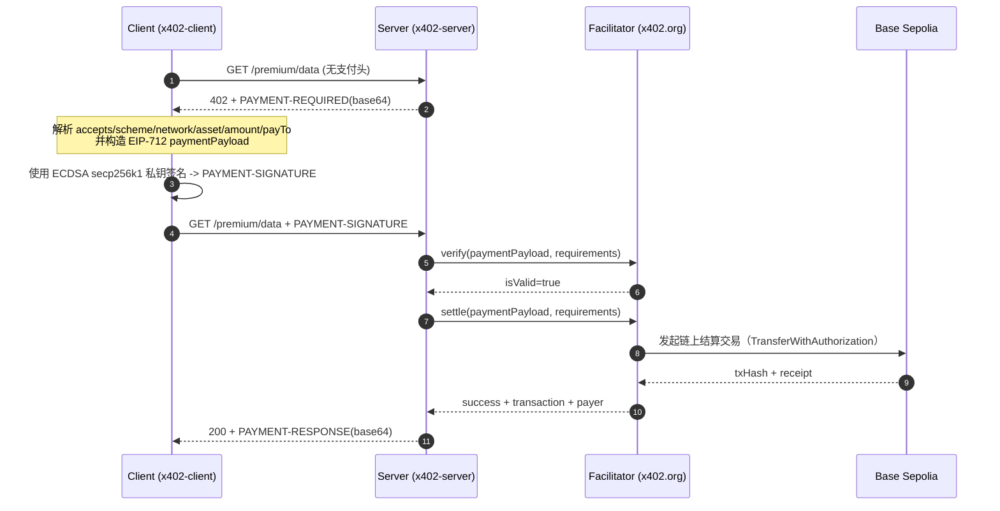

# x402 EVM 详细过程解析

- 运行时间：2026-03-10T15:09:29.065Z
- 资源地址：http://localhost:4020/premium/data
- Facilitator：https://www.x402.org/facilitator
- 网络：Base Sepolia（`eip155:84532`）
- 端到端耗时：1123 ms（首跳 3 ms + 二跳 1120 ms）

---

## 0) 执行概览

本次测试验证 x402 协议在 EVM 链（Base Sepolia）上的完整双跳支付流程。客户端请求受保护资源，服务端返回 402 挑战，客户端构造 EIP-712 签名后重试，facilitator 完成链上结算。

## 时序图（x402 EVM 双跳支付）



## 关键步骤说明

1. **发现资源受保护**
   Client 首跳不带支付头，Server 返回 402，通过 `PAYMENT-REQUIRED` header 明确支付条件。

2. **解析支付条件并做本地校验**
   Client 必须核对 `network/asset/payTo/amount/maxTimeoutSeconds` 是否符合预期，防止错链、错币或目标地址被替换。

3. **构造 EIP-712 签名载荷**
   Client 从 requirements 选定一条 `accepted`，按 EIP-3009 `TransferWithAuthorization` 规则构造 typed data。

4. **本地签名**
   Client 用 ECDSA secp256k1 私钥对 EIP-712 typed data 签名，输出 `payload.signature`（65 bytes hex）。

5. **二跳重试**
   Client 携带 `PAYMENT-SIGNATURE` header 重试同一资源请求。

6. **服务端验签（verify）**
   Server 调 facilitator `verify` 检查签名有效性与参数一致性。

7. **服务端结算（settle）**
   验签通过后，Server 调 facilitator `settle`，facilitator 调用 USDC 合约的 `transferWithAuthorization` 在链上完成转账。

8. **返回业务数据 + 结算回执**
   成功后 Server 返回 200，在 `PAYMENT-RESPONSE` header 带回 `success/transaction/network/payer`。

9. **链上核验闭环**
   可按 `txHash` 查询 receipt，与 HTTP 回执交叉验证，形成证据链。

---

本次结果：
- 首跳状态：`402`
- 二跳状态：`200`
- 结算交易：`0xa753c83676303bf5675e668b7c700c20d834e6882e0c7e2b45bd01d08f3642a6`

---

## 1) Request 阶段（请求与挑战）

### 1.1 首跳请求

首跳的核心作用是获取"支付挑战参数"（即服务端声明你要按什么条件付费）。

- Method：`GET`
- URL：`http://localhost:4020/premium/data`
- 响应状态：`402`
- 耗时：3 ms

### 1.2 PAYMENT-REQUIRED 关键字段解释（按层级）

- 根对象
  - `x402Version`: `2`
  - `error`: `Payment required`
  - `resource`: 资源元信息对象
  - `accepts`: 可接受支付条件数组

- `resource` 对象
  - `resource.url`: `http://localhost:4020/premium/data`
  - `resource.description`: `Premium x402-protected JSON`
  - `resource.mimeType`: `application/json`

- `accepts[0]` 对象（本次选中条款）
  - `accepts[0].scheme`: `exact` — 精确金额支付模式
  - `accepts[0].network`: `eip155:84532` — Base Sepolia（CAIP-2 格式，chainId=84532）
  - `accepts[0].asset`: `0x036CbD53842c5426634e7929541eC2318f3dCF7e` — USDC 合约地址（decimals=6）
  - `accepts[0].amount`: `1000` — 最小单位（1000 = 0.001 USDC，因 USDC decimals=6）
  - `accepts[0].payTo`: `0x92F6E9deBbEb778a245916Cf52DD7F54429Fff24` — 收款方地址
  - `accepts[0].maxTimeoutSeconds`: `300` — 签名最大有效期（5 分钟）
  - `accepts[0].extra`: 资产/域附加信息

- `accepts[0].extra` 对象（EIP-712 domain 参数，用于构造签名）
  - `accepts[0].extra.name`: `USDC` — EIP-712 domain name
  - `accepts[0].extra.version`: `2` — EIP-712 domain version

PAYMENT-REQUIRED 原文（header base64）：
```
eyJ4NDAyVmVyc2lvbiI6MiwiZXJyb3IiOiJQYXltZW50IHJlcXVpcmVkIiwicmVzb3VyY2UiOnsidXJsIjoiaHR0cDovL2xvY2FsaG9zdDo0MDIwL3ByZW1pdW0vZGF0YSIsImRlc2NyaXB0aW9uIjoiUHJlbWl1bSB4NDAyLXByb3RlY3RlZCBKU09OIiwibWltZVR5cGUiOiJhcHBsaWNhdGlvbi9qc29uIn0sImFjY2VwdHMiOlt7InNjaGVtZSI6ImV4YWN0IiwibmV0d29yayI6ImVpcDE1NTo4NDUzMiIsImFtb3VudCI6IjEwMDAiLCJhc3NldCI6IjB4MDM2Q2JENTM4NDJjNTQyNjYzNGU3OTI5NTQxZUMyMzE4ZjNkQ0Y3ZSIsInBheVRvIjoiMHg5MkY2RTlkZUJiRWI3NzhhMjQ1OTE2Q2Y1MkREN0Y1NDQyOUZmZjI0IiwibWF4VGltZW91dFNlY29uZHMiOjMwMCwiZXh0cmEiOnsibmFtZSI6IlVTREMiLCJ2ZXJzaW9uIjoiMiJ9fV19
```

PAYMENT-REQUIRED 解码：

```json
{
  "x402Version": 2,
  "error": "Payment required",
  "resource": {
    "url": "http://localhost:4020/premium/data",
    "description": "Premium x402-protected JSON",
    "mimeType": "application/json"
  },
  "accepts": [
    {
      "scheme": "exact",
      "network": "eip155:84532",
      "amount": "1000",
      "asset": "0x036CbD53842c5426634e7929541eC2318f3dCF7e",
      "payTo": "0x92F6E9deBbEb778a245916Cf52DD7F54429Fff24",
      "maxTimeoutSeconds": 300,
      "extra": {
        "name": "USDC",
        "version": "2"
      }
    }
  ]
}
```

---

## 2) Signature 阶段（签名构造与参数）

### 2.1 构造签名消息（EIP-712 Typed Data）

Client 从首跳的 `accepts[0]` 中提取参数，按 EIP-3009 `TransferWithAuthorization` 规则构造 EIP-712 typed data。这是实际被签名的结构化消息。

**EIP-712 domain 参数来源**：
- `name` / `version`：来自 `accepts[0].extra`
- `chainId`：从 `accepts[0].network`（`eip155:84532`）解析
- `verifyingContract`：即 `accepts[0].asset`（USDC 合约地址）

**message 参数来源**：
- `from`：客户端钱包地址（付款方）
- `to`：`accepts[0].payTo`（收款方）
- `value`：`accepts[0].amount`（最小单位金额）
- `validAfter` / `validBefore`：SDK 自动生成（当前时间 ± `maxTimeoutSeconds`）
- `nonce`：随机 bytes32（防重放）

```json
{
  "domain": {
    "name": "USDC",
    "version": "2",
    "chainId": 84532,
    "verifyingContract": "0x036CbD53842c5426634e7929541eC2318f3dCF7e"
  },
  "types": {
    "TransferWithAuthorization": [
      { "name": "from", "type": "address" },
      { "name": "to", "type": "address" },
      { "name": "value", "type": "uint256" },
      { "name": "validAfter", "type": "uint256" },
      { "name": "validBefore", "type": "uint256" },
      { "name": "nonce", "type": "bytes32" }
    ]
  },
  "primaryType": "TransferWithAuthorization",
  "message": {
    "from": "0x92F6E9deBbEb778a245916Cf52DD7F54429Fff24",
    "to": "0x92F6E9deBbEb778a245916Cf52DD7F54429Fff24",
    "value": "1000",
    "validAfter": "1773154767",
    "validBefore": "1773155667",
    "nonce": "0x46aca7afc03be980c2281a740b9f1cffa81aa74ff6b6e51b234080302258c4e7"
  }
}
```

### 2.2 签名

Client 用 ECDSA secp256k1 私钥对上述 EIP-712 typed data 进行签名，输出 65 bytes 签名（r + s + v）：

```
0x5a9d4ad9b6e28031cf6ecd52c8ac57caf372e9e8f66a90f0f22947eda2e09002
366b42aa2a735a0704562acf9a7d063c48f69f737e6a2b1e5e2764e4b578865f1c
```

签名结果与 `authorization` 消息一起组装为 `payload` 对象。

### 2.3 组装 PAYMENT-SIGNATURE 并发送二跳请求

签名完成后，Client 将 `payload`（authorization + signature）、`resource`、`accepted` 组装为完整的 PAYMENT-SIGNATURE 对象，base64 编码后作为 HTTP header 发送。

- Method：`GET`
- URL：`http://localhost:4020/premium/data`
- 耗时：1120 ms

**PAYMENT-SIGNATURE 对象解释（按层级）**：

- 根对象
  - `x402Version`: `2`
  - `payload`: 签名载荷对象
  - `resource`: 资源对象（与首跳 challenge 对齐）
  - `accepted`: 本次接受的支付条款对象

- `payload` 对象
  - `payload.authorization`: EIP-3009 `TransferWithAuthorization` 被签名核心消息（即 2.1 中的 message）
  - `payload.signature`: 2.2 中的 ECDSA 签名结果

- `payload.authorization` 对象
  - `payload.authorization.from`: `0x92F6E9deBbEb778a245916Cf52DD7F54429Fff24` — 付款方地址
  - `payload.authorization.to`: `0x92F6E9deBbEb778a245916Cf52DD7F54429Fff24` — 收款方地址
  - `payload.authorization.value`: `1000` — 转账金额（最小单位）
  - `payload.authorization.validAfter`: `1773154767` — 签名生效时间（Unix timestamp）
  - `payload.authorization.validBefore`: `1773155667` — 签名过期时间（Unix timestamp）
  - `payload.authorization.nonce`: `0x46aca7afc03be980c2281a740b9f1cffa81aa74ff6b6e51b234080302258c4e7` — 随机 nonce（bytes32，防重放）

- `accepted` 对象（与首跳 `accepts[0]` 一致）
  - `accepted.scheme`: `exact`
  - `accepted.network`: `eip155:84532`
  - `accepted.asset`: `0x036CbD53842c5426634e7929541eC2318f3dCF7e`
  - `accepted.amount`: `1000`
  - `accepted.payTo`: `0x92F6E9deBbEb778a245916Cf52DD7F54429Fff24`
  - `accepted.maxTimeoutSeconds`: `300`
  - `accepted.extra`: `{ name: "USDC", version: "2" }`

PAYMENT-SIGNATURE 完整解码：

```json
{
  "x402Version": 2,
  "payload": {
    "authorization": {
      "from": "0x92F6E9deBbEb778a245916Cf52DD7F54429Fff24",
      "to": "0x92F6E9deBbEb778a245916Cf52DD7F54429Fff24",
      "value": "1000",
      "validAfter": "1773154767",
      "validBefore": "1773155667",
      "nonce": "0x46aca7afc03be980c2281a740b9f1cffa81aa74ff6b6e51b234080302258c4e7"
    },
    "signature": "0x5a9d4ad9b6e28031cf6ecd52c8ac57caf372e9e8f66a90f0f22947eda2e09002366b42aa2a735a0704562acf9a7d063c48f69f737e6a2b1e5e2764e4b578865f1c"
  },
  "resource": {
    "url": "http://localhost:4020/premium/data",
    "description": "Premium x402-protected JSON",
    "mimeType": "application/json"
  },
  "accepted": {
    "scheme": "exact",
    "network": "eip155:84532",
    "amount": "1000",
    "asset": "0x036CbD53842c5426634e7929541eC2318f3dCF7e",
    "payTo": "0x92F6E9deBbEb778a245916Cf52DD7F54429Fff24",
    "maxTimeoutSeconds": 300,
    "extra": {
      "name": "USDC",
      "version": "2"
    }
  }
}
```

PAYMENT-SIGNATURE 原文（header base64）：
```
eyJ4NDAyVmVyc2lvbiI6MiwicGF5bG9hZCI6eyJhdXRob3JpemF0aW9uIjp7ImZyb20iOiIweDkyRjZFOWRlQmJFYjc3OGEyNDU5MTZDZjUyREQ3RjU0NDI5RmZmMjQiLCJ0byI6IjB4OTJGNkU5ZGVCYkViNzc4YTI0NTkxNkNmNTJERDdGNTQ0MjlGZmYyNCIsInZhbHVlIjoiMTAwMCIsInZhbGlkQWZ0ZXIiOiIxNzczMTU0NzY3IiwidmFsaWRCZWZvcmUiOiIxNzczMTU1NjY3Iiwibm9uY2UiOiIweDQ2YWNhN2FmYzAzYmU5ODBjMjI4MWE3NDBiOWYxY2ZmYTgxYWE3NGZmNmI2ZTUxYjIzNDA4MDMwMjI1OGM0ZTcifSwic2lnbmF0dXJlIjoiMHg1YTlkNGFkOWI2ZTI4MDMxY2Y2ZWNkNTJjOGFjNTdjYWYzNzJlOWU4ZjY2YTkwZjBmMjI5NDdlZGEyZTA5MDAyMzY2YjQyYWEyYTczNWEwNzA0NTYyYWNmOWE3ZDA2M2M0OGY2OWY3MzdlNmEyYjFlNWUyNzY0ZTRiNTc4ODY1ZjFjIn0sInJlc291cmNlIjp7InVybCI6Imh0dHA6Ly9sb2NhbGhvc3Q6NDAyMC9wcmVtaXVtL2RhdGEiLCJkZXNjcmlwdGlvbiI6IlByZW1pdW0geDQwMi1wcm90ZWN0ZWQgSlNPTiIsIm1pbWVUeXBlIjoiYXBwbGljYXRpb24vanNvbiJ9LCJhY2NlcHRlZCI6eyJzY2hlbWUiOiJleGFjdCIsIm5ldHdvcmsiOiJlaXAxNTU6ODQ1MzIiLCJhbW91bnQiOiIxMDAwIiwiYXNzZXQiOiIweDAzNkNiRDUzODQyYzU0MjY2MzRlNzkyOTU0MWVDMjMxOGYzZENGN2UiLCJwYXlUbyI6IjB4OTJGNkU5ZGVCYkViNzc4YTI0NTkxNkNmNTJERDdGNTQ0MjlGZmYyNCIsIm1heFRpbWVvdXRTZWNvbmRzIjozMDAsImV4dHJhIjp7Im5hbWUiOiJVU0RDIiwidmVyc2lvbiI6IjIifX19
```

---

## 3) Settlement 阶段（服务端验签与结算）

### 3.1 PAYMENT-RESPONSE

`PAYMENT-RESPONSE` 是结算回执，说明 facilitator 已在链上完成 USDC 转账。

- 二跳响应状态：`200`
- 响应体：`{"data":{"message":"x402 payment succeeded","timestamp":"2026-03-10T15:09:29.065Z"}}`

PAYMENT-RESPONSE 原文（header base64）：
```
eyJzdWNjZXNzIjp0cnVlLCJ0cmFuc2FjdGlvbiI6IjB4YTc1M2M4MzY3NjMwM2JmNTY3NWU2NjhiN2M3MDBjMjBkODM0ZTY4ODJlMGM3ZTJiNDViZDAxZDA4ZjM2NDJhNiIsIm5ldHdvcmsiOiJlaXAxNTU6ODQ1MzIiLCJwYXllciI6IjB4OTJGNkU5ZGVCYkViNzc4YTI0NTkxNkNmNTJERDdGNTQ0MjlGZmYyNCJ9
```

PAYMENT-RESPONSE 解码：

```json
{
  "success": true,
  "transaction": "0xa753c83676303bf5675e668b7c700c20d834e6882e0c7e2b45bd01d08f3642a6",
  "network": "eip155:84532",
  "payer": "0x92F6E9deBbEb778a245916Cf52DD7F54429Fff24"
}
```

关键参数解释：
- `success`: `true` — 结算成功
- `transaction`: `0xa753c83...` — 链上结算交易哈希（facilitator 发起的 `transferWithAuthorization` 调用）
- `network`: `eip155:84532` — Base Sepolia
- `payer`: `0x92F6E9de...` — 支付方地址

---

## 4) On-chain 阶段（链上凭证）

链上核验用于把 HTTP 层回执和真实链上状态对齐。

- txHash：`0xa753c83676303bf5675e668b7c700c20d834e6882e0c7e2b45bd01d08f3642a6`
- receipt.status：`success`
- receipt.blockNumber：`38693541`
- receipt.from：`0xd407e409e34e0b9afb99ecceb609bdbcd5e7f1bf`（facilitator signer）
- receipt.to：`0x036cbd53842c5426634e7929541ec2318f3dcf7e`（USDC 合约）
- receipt.gasUsed：`78188`
- receipt.effectiveGasPrice：`6000000` wei
- receipt.logs 数量：`2`

> 注意：`receipt.from` 是 facilitator 的链上签名者地址（非买方），因为 EIP-3009 由 facilitator 代为提交交易。买方仅提供授权签名，不支付 gas。

### 4.1 余额核对（运行前后）
- Before：ETH 0.01，USDC 40（raw 40000000）
- After：ETH 0.01，USDC 40（raw 40000000）

> 说明：本次收款方 = 付款方（同地址测试），且金额极小（0.001 USDC），余额变化在 raw 精度下为 ±1000，需查交易日志确认。

---

## 5) 风险与检查建议

- 检查 `accepted` 与首跳 `accepts` 是否一致（防参数替换）
- 检查 `network/asset` 是否为预期测试网资产（防错链）
- 检查 `maxTimeoutSeconds` 是否合理（防重放窗口过大）
- EIP-3009 `nonce`（bytes32 随机值）+ `validAfter/validBefore` 时间窗提供防重放保护
- 保证私钥仅在 client 侧存在，不进入 server 日志
- `receipt.from` 应为已知 facilitator signer 地址，非第三方

## 6) 补充信息

### 6.1 参数可读化
- `network`: `eip155:84532`（Base Sepolia，chainId=84532）
- `asset`: `0x036CbD53842c5426634e7929541eC2318f3dCF7e`（USDC，decimals=6）
- `amount`: `1000`（即 `0.001 USDC`）
- `authorization.validAfter`: `1773154767`（2026-03-08T06:39:27Z）
- `authorization.validBefore`: `1773155667`（2026-03-08T06:54:27Z）
- 签名有效窗口：`900s`（15 分钟）

### 6.2 外部核验链接
- Tx: <https://sepolia.basescan.org/tx/0xa753c83676303bf5675e668b7c700c20d834e6882e0c7e2b45bd01d08f3642a6>
- Payer: <https://sepolia.basescan.org/address/0x92F6E9deBbEb778a245916Cf52DD7F54429Fff24>
- Facilitator signer: <https://sepolia.basescan.org/address/0xd407e409e34e0b9afb99ecceb609bdbcd5e7f1bf>
- USDC 合约: <https://sepolia.basescan.org/address/0x036CbD53842c5426634e7929541eC2318f3dCF7e>

### 6.3 执行环境
- 运行模式：Docker Compose（server/client）
- 服务暴露：`127.0.0.1:4020`（仅本机）
- Facilitator：`https://www.x402.org/facilitator`
- SDK 版本：`@x402/evm@2.6.0`，`viem@2.37.5`

---

> 该报告基于 `run-and-report.ts` 生成的 JSON 运行产物增强。
