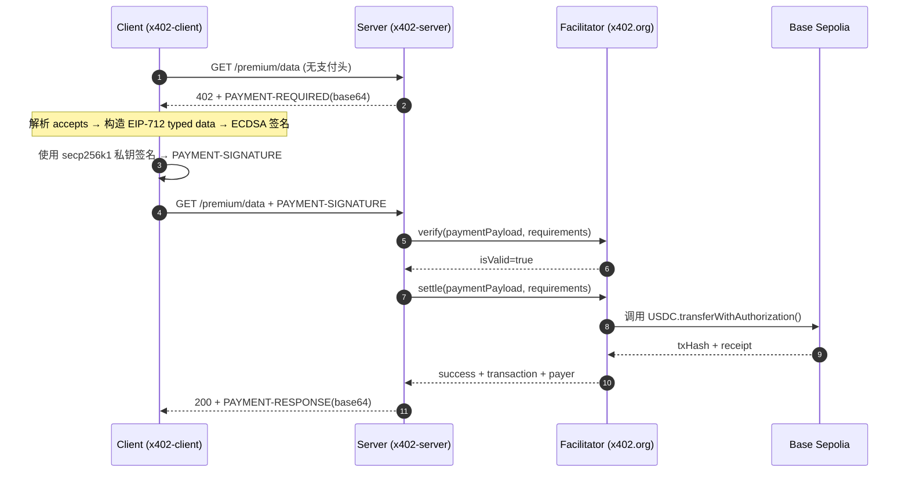

# x402 EVM 详细过程解析

- 运行时间：2026-03-10T15:09:29.065Z
- 资源地址：http://localhost:4020/premium/data
- Facilitator：https://www.x402.org/facilitator
- 网络：Base Sepolia（`eip155:84532`）
- 端到端耗时：1123 ms（首跳 3 ms + 二跳 1120 ms）

---

## 1) 时序图与关键步骤



**关键步骤说明**：

1. **首跳请求**：Client 不带支付头请求资源，Server 返回 `402` + `PAYMENT-REQUIRED` header
2. **解析支付条件**：Client 校验 `network/asset/payTo/amount` 是否符合预期
3. **构造 EIP-712 签名消息**：按 EIP-3009 `TransferWithAuthorization` 规则，从 `accepts[0]` 提取参数构造 typed data
4. **本地签名**：ECDSA secp256k1 签名，输出 65 bytes（r+s+v）
5. **二跳请求**：携带 `PAYMENT-SIGNATURE` header 重试
6. **服务端验签**：Server → Facilitator `verify`
7. **链上结算**：Facilitator 调用 USDC 合约 `transferWithAuthorization`
8. **返回结果**：`200` + 业务数据 + `PAYMENT-RESPONSE` 结算回执

---

## 2) 本次测试数据记录

### 2.1 首跳：获取 PAYMENT-REQUIRED

- Method：`GET`
- URL：`http://localhost:4020/premium/data`
- 响应状态：`402`
- 耗时：3 ms

**PAYMENT-REQUIRED 原文**（header base64）：
```
eyJ4NDAyVmVyc2lvbiI6MiwiZXJyb3IiOiJQYXltZW50IHJlcXVpcmVkIiwicmVzb3VyY2UiOnsidXJsIjoiaHR0cDovL2xvY2FsaG9zdDo0MDIwL3ByZW1pdW0vZGF0YSIsImRlc2NyaXB0aW9uIjoiUHJlbWl1bSB4NDAyLXByb3RlY3RlZCBKU09OIiwibWltZVR5cGUiOiJhcHBsaWNhdGlvbi9qc29uIn0sImFjY2VwdHMiOlt7InNjaGVtZSI6ImV4YWN0IiwibmV0d29yayI6ImVpcDE1NTo4NDUzMiIsImFtb3VudCI6IjEwMDAiLCJhc3NldCI6IjB4MDM2Q2JENTM4NDJjNTQyNjYzNGU3OTI5NTQxZUMyMzE4ZjNkQ0Y3ZSIsInBheVRvIjoiMHg5MkY2RTlkZUJiRWI3NzhhMjQ1OTE2Q2Y1MkREN0Y1NDQyOUZmZjI0IiwibWF4VGltZW91dFNlY29uZHMiOjMwMCwiZXh0cmEiOnsibmFtZSI6IlVTREMiLCJ2ZXJzaW9uIjoiMiJ9fV19
```

**PAYMENT-REQUIRED 解码**：

```json
{
  "x402Version": 2,
  "error": "Payment required",
  "resource": {
    "url": "http://localhost:4020/premium/data",
    "description": "Premium x402-protected JSON",
    "mimeType": "application/json"
  },
  "accepts": [
    {
      "scheme": "exact",
      "network": "eip155:84532",
      "amount": "1000",
      "asset": "0x036CbD53842c5426634e7929541eC2318f3dCF7e",
      "payTo": "0x92F6E9deBbEb778a245916Cf52DD7F54429Fff24",
      "maxTimeoutSeconds": 300,
      "extra": {
        "name": "USDC",
        "version": "2"
      }
    }
  ]
}
```

**关键字段解释**：

- `x402Version`: `2` — 协议版本
- `resource`：被保护的资源元信息
- `accepts[0].scheme`: `exact` — 精确金额支付模式
- `accepts[0].network`: `eip155:84532` — Base Sepolia（CAIP-2 格式，chainId=84532）
- `accepts[0].asset`: `0x036CbD53842c5426634e7929541eC2318f3dCF7e` — USDC 合约（decimals=6）
- `accepts[0].amount`: `1000` — 最小单位（= 0.001 USDC）
- `accepts[0].payTo`: `0x92F6E9deBbEb778a245916Cf52DD7F54429Fff24` — 收款方
- `accepts[0].maxTimeoutSeconds`: `300` — 签名有效期上限（5 分钟）
- `accepts[0].extra.name` / `extra.version`: EIP-712 domain 参数（`USDC` / `2`）

---

### 2.2 从 PAYMENT-REQUIRED 构造待签名对象

Client 从 `accepts[0]` 提取参数，按 EIP-3009 `TransferWithAuthorization` 构造 EIP-712 typed data：

**参数映射**：
- `domain.name` / `domain.version` ← `accepts[0].extra.name` / `extra.version`
- `domain.chainId` ← 从 `accepts[0].network`（`eip155:84532`）解析
- `domain.verifyingContract` ← `accepts[0].asset`
- `message.from` ← 客户端钱包地址
- `message.to` ← `accepts[0].payTo`
- `message.value` ← `accepts[0].amount`
- `message.validAfter` / `validBefore` ← SDK 自动生成（当前时间 ± `maxTimeoutSeconds`）
- `message.nonce` ← 随机 bytes32（防重放）

**实际构造的 EIP-712 Typed Data**：

```json
{
  "domain": {
    "name": "USDC",
    "version": "2",
    "chainId": 84532,
    "verifyingContract": "0x036CbD53842c5426634e7929541eC2318f3dCF7e"
  },
  "types": {
    "TransferWithAuthorization": [
      { "name": "from", "type": "address" },
      { "name": "to", "type": "address" },
      { "name": "value", "type": "uint256" },
      { "name": "validAfter", "type": "uint256" },
      { "name": "validBefore", "type": "uint256" },
      { "name": "nonce", "type": "bytes32" }
    ]
  },
  "primaryType": "TransferWithAuthorization",
  "message": {
    "from": "0x92F6E9deBbEb778a245916Cf52DD7F54429Fff24",
    "to": "0x92F6E9deBbEb778a245916Cf52DD7F54429Fff24",
    "value": "1000",
    "validAfter": "1773154767",
    "validBefore": "1773155667",
    "nonce": "0x46aca7afc03be980c2281a740b9f1cffa81aa74ff6b6e51b234080302258c4e7"
  }
}
```

ECDSA secp256k1 签名结果（65 bytes）：
```
0x5a9d4ad9b6e28031cf6ecd52c8ac57caf372e9e8f66a90f0f22947eda2e09002366b42aa2a735a0704562acf9a7d063c48f69f737e6a2b1e5e2764e4b578865f1c
```

---

### 2.3 二跳：发送 PAYMENT-SIGNATURE

签名后，Client 将 `payload`（authorization + signature）、`resource`、`accepted` 组装为 PAYMENT-SIGNATURE，base64 编码后作为 header 发送。

- Method：`GET`
- URL：`http://localhost:4020/premium/data`
- 耗时：1120 ms

**PAYMENT-SIGNATURE 原文**（header base64）：
```
eyJ4NDAyVmVyc2lvbiI6MiwicGF5bG9hZCI6eyJhdXRob3JpemF0aW9uIjp7ImZyb20iOiIweDkyRjZFOWRlQmJFYjc3OGEyNDU5MTZDZjUyREQ3RjU0NDI5RmZmMjQiLCJ0byI6IjB4OTJGNkU5ZGVCYkViNzc4YTI0NTkxNkNmNTJERDdGNTQ0MjlGZmYyNCIsInZhbHVlIjoiMTAwMCIsInZhbGlkQWZ0ZXIiOiIxNzczMTU0NzY3IiwidmFsaWRCZWZvcmUiOiIxNzczMTU1NjY3Iiwibm9uY2UiOiIweDQ2YWNhN2FmYzAzYmU5ODBjMjI4MWE3NDBiOWYxY2ZmYTgxYWE3NGZmNmI2ZTUxYjIzNDA4MDMwMjI1OGM0ZTcifSwic2lnbmF0dXJlIjoiMHg1YTlkNGFkOWI2ZTI4MDMxY2Y2ZWNkNTJjOGFjNTdjYWYzNzJlOWU4ZjY2YTkwZjBmMjI5NDdlZGEyZTA5MDAyMzY2YjQyYWEyYTczNWEwNzA0NTYyYWNmOWE3ZDA2M2M0OGY2OWY3MzdlNmEyYjFlNWUyNzY0ZTRiNTc4ODY1ZjFjIn0sInJlc291cmNlIjp7InVybCI6Imh0dHA6Ly9sb2NhbGhvc3Q6NDAyMC9wcmVtaXVtL2RhdGEiLCJkZXNjcmlwdGlvbiI6IlByZW1pdW0geDQwMi1wcm90ZWN0ZWQgSlNPTiIsIm1pbWVUeXBlIjoiYXBwbGljYXRpb24vanNvbiJ9LCJhY2NlcHRlZCI6eyJzY2hlbWUiOiJleGFjdCIsIm5ldHdvcmsiOiJlaXAxNTU6ODQ1MzIiLCJhbW91bnQiOiIxMDAwIiwiYXNzZXQiOiIweDAzNkNiRDUzODQyYzU0MjY2MzRlNzkyOTU0MWVDMjMxOGYzZENGN2UiLCJwYXlUbyI6IjB4OTJGNkU5ZGVCYkViNzc4YTI0NTkxNkNmNTJERDdGNTQ0MjlGZmYyNCIsIm1heFRpbWVvdXRTZWNvbmRzIjozMDAsImV4dHJhIjp7Im5hbWUiOiJVU0RDIiwidmVyc2lvbiI6IjIifX19
```

**PAYMENT-SIGNATURE 解码**：

```json
{
  "x402Version": 2,
  "payload": {
    "authorization": {
      "from": "0x92F6E9deBbEb778a245916Cf52DD7F54429Fff24",
      "to": "0x92F6E9deBbEb778a245916Cf52DD7F54429Fff24",
      "value": "1000",
      "validAfter": "1773154767",
      "validBefore": "1773155667",
      "nonce": "0x46aca7afc03be980c2281a740b9f1cffa81aa74ff6b6e51b234080302258c4e7"
    },
    "signature": "0x5a9d4ad9b6e28031cf6ecd52c8ac57caf372e9e8f66a90f0f22947eda2e09002366b42aa2a735a0704562acf9a7d063c48f69f737e6a2b1e5e2764e4b578865f1c"
  },
  "resource": {
    "url": "http://localhost:4020/premium/data",
    "description": "Premium x402-protected JSON",
    "mimeType": "application/json"
  },
  "accepted": {
    "scheme": "exact",
    "network": "eip155:84532",
    "amount": "1000",
    "asset": "0x036CbD53842c5426634e7929541eC2318f3dCF7e",
    "payTo": "0x92F6E9deBbEb778a245916Cf52DD7F54429Fff24",
    "maxTimeoutSeconds": 300,
    "extra": {
      "name": "USDC",
      "version": "2"
    }
  }
}
```

**关键字段解释**：

- `payload.authorization`：即 2.2 中构造的 EIP-712 message（被签名的核心内容）
  - `from` / `to`：付款方 / 收款方地址
  - `value`: `1000`（0.001 USDC）
  - `validAfter` / `validBefore`：签名时间窗（Unix timestamp）
  - `nonce`：随机 bytes32（防重放）
- `payload.signature`：2.2 中的 ECDSA 签名结果
- `resource`：与首跳 challenge 中的 resource 对齐
- `accepted`：客户端选择接受的支付条款（应与 `accepts[0]` 一致）

---

### 2.4 结算：PAYMENT-RESPONSE

二跳响应状态：`200`
响应体：`{"data":{"message":"x402 payment succeeded","timestamp":"2026-03-10T15:09:29.065Z"}}`

**PAYMENT-RESPONSE 原文**（header base64）：
```
eyJzdWNjZXNzIjp0cnVlLCJ0cmFuc2FjdGlvbiI6IjB4YTc1M2M4MzY3NjMwM2JmNTY3NWU2NjhiN2M3MDBjMjBkODM0ZTY4ODJlMGM3ZTJiNDViZDAxZDA4ZjM2NDJhNiIsIm5ldHdvcmsiOiJlaXAxNTU6ODQ1MzIiLCJwYXllciI6IjB4OTJGNkU5ZGVCYkViNzc4YTI0NTkxNkNmNTJERDdGNTQ0MjlGZmYyNCJ9
```

**PAYMENT-RESPONSE 解码**：

```json
{
  "success": true,
  "transaction": "0xa753c83676303bf5675e668b7c700c20d834e6882e0c7e2b45bd01d08f3642a6",
  "network": "eip155:84532",
  "payer": "0x92F6E9deBbEb778a245916Cf52DD7F54429Fff24"
}
```

**关键字段解释**：

- `success`: `true` — 结算成功
- `transaction` — 链上结算交易哈希（facilitator 调用 `transferWithAuthorization` 的 tx）
- `network`: `eip155:84532` — Base Sepolia
- `payer` — facilitator 识别到的支付方地址

**链上交易详情**（from receipt）：

- txHash：`0xa753c83676303bf5675e668b7c700c20d834e6882e0c7e2b45bd01d08f3642a6`
- status：`success`
- blockNumber：`38693541`
- from：`0xd407e409e34e0b9afb99ecceb609bdbcd5e7f1bf`（facilitator signer，非买方）
- to：`0x036cbd53842c5426634e7929541ec2318f3dcf7e`（USDC 合约）
- gasUsed：`78188`
- effectiveGasPrice：`6000000` wei

> 注意：`receipt.from` 是 facilitator 的链上签名者，因为 EIP-3009 由 facilitator 代为提交交易，买方仅提供授权签名。

---

### 2.5 链上核验链接

- Tx: <https://sepolia.basescan.org/tx/0xa753c83676303bf5675e668b7c700c20d834e6882e0c7e2b45bd01d08f3642a6>
- Payer: <https://sepolia.basescan.org/address/0x92F6E9deBbEb778a245916Cf52DD7F54429Fff24>
- Facilitator signer: <https://sepolia.basescan.org/address/0xd407e409e34e0b9afb99ecceb609bdbcd5e7f1bf>
- USDC 合约: <https://sepolia.basescan.org/address/0x036CbD53842c5426634e7929541eC2318f3dCF7e>

**参数速查**：
- `network`: `eip155:84532`（Base Sepolia，chainId=84532）
- `asset`: `0x036CbD53842c5426634e7929541eC2318f3dCF7e`（USDC，decimals=6）
- `amount`: `1000`（= 0.001 USDC）
- `validAfter → validBefore`: `1773154767 → 1773155667`（有效窗口 900s = 15 分钟）

**执行环境**：
- 运行模式：Docker Compose（server/client）
- 服务暴露：`127.0.0.1:4020`（仅本机）
- Facilitator：`https://www.x402.org/facilitator`
- SDK：`@x402/evm@2.6.0`，`viem@2.37.5`

---

> 该报告基于 `run-and-report.ts` 生成的 JSON 运行产物增强。
