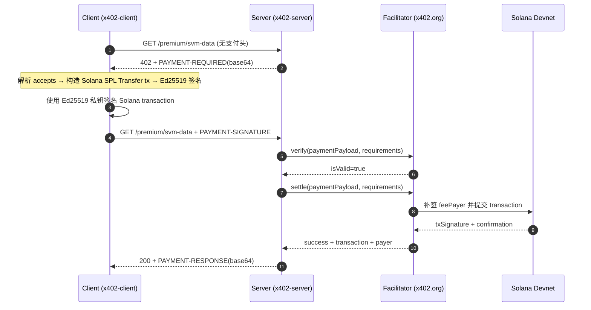

# x402 SVM 详细过程解析

- 运行时间：2026-03-14T03:20:14.453Z
- 资源地址：http://localhost:4020/premium/svm-data
- Facilitator：https://www.x402.org/facilitator
- 网络：Solana Devnet（`solana:EtWTRABZaYq6iMfeYKouRu166VU2xqa1`）
- 端到端耗时：2180 ms（首跳 15 ms + 二跳 2165 ms）

---

## 1) 时序图与关键步骤



**关键步骤说明**：

1. **首跳请求**：Client 不带支付头请求资源，Server 返回 `402` + `PAYMENT-REQUIRED` header
2. **解析支付条件**：Client 校验 `network/asset/payTo/amount` 是否符合预期
3. **构造 Solana Transaction**：按 x402 SVM exact 规则，构造 SPL Token 转账 + Memo 防重放指令
4. **本地签名**：Ed25519 签名嵌入 transaction signatures 数组，feePayer 签名位留空
5. **二跳请求**：携带 `PAYMENT-SIGNATURE` header 重试
6. **服务端验签**：Server → Facilitator `verify`
7. **链上结算**：Facilitator 用 feePayer 私钥补签后提交 transaction 到 Solana
8. **返回结果**：`200` + 业务数据 + `PAYMENT-RESPONSE` 结算回执

**EVM vs SVM 对比**：

| 维度 | EVM (exact) | SVM (exact) |
|---|---|---|
| 签名格式 | EIP-712 typed data | Solana transaction（Ed25519） |
| 签名内容 | 结构化消息（from/to/value/nonce） | 完整 transaction message（指令+账户+blockhash） |
| 防重放 | nonce + validAfter/validBefore | recentBlockhash (~90s) + Memo nonce |
| Gas 支付 | Facilitator signer 代付（ETH） | Facilitator feePayer 代付（SOL） |
| 资产转移 | EIP-3009 TransferWithAuthorization | SPL Token Transfer |

---

## 2) 本次测试数据记录

### 2.1 首跳：获取 PAYMENT-REQUIRED

- Method：`GET`
- URL：`http://localhost:4020/premium/svm-data`
- 响应状态：`402`
- 耗时：15 ms

**PAYMENT-REQUIRED 原文**（header base64）：
```
eyJ4NDAyVmVyc2lvbiI6MiwiZXJyb3IiOiJQYXltZW50IHJlcXVpcmVkIiwicmVzb3VyY2UiOnsidXJsIjoiaHR0cDovL2xvY2FsaG9zdDo0MDIwL3ByZW1pdW0vc3ZtLWRhdGEiLCJkZXNjcmlwdGlvbiI6IlByZW1pdW0geDQwMi1wcm90ZWN0ZWQgSlNPTiAoU1ZNKSIsIm1pbWVUeXBlIjoiYXBwbGljYXRpb24vanNvbiJ9LCJhY2NlcHRzIjpbeyJzY2hlbWUiOiJleGFjdCIsIm5ldHdvcmsiOiJzb2xhbmE6RXRXVFJBQlphWXE2aU1mZVlLb3VSdTE2NlZVMnhxYTEiLCJhbW91bnQiOiIxIiwiYXNzZXQiOiI0ek1NQzlzcnQ1Umk1WDE0R0FnWGhhSGlpM0duUEFFRVJZUEpnWkpEbmNEVSIsInBheVRvIjoiRTU1cUxLcXZRWWFiVXdXNmRoa0MxUVhUTWZhWWYyc1g3cDdVdkVUWVhEWjEiLCJtYXhUaW1lb3V0U2Vjb25kcyI6MzAwLCJleHRyYSI6eyJmZWVQYXllciI6IkNLUEtKV05kSkVxYTgxeDdDa1oxNEJWUGlZNnkxNlN4czdvd3pucXRXWXA1In19XX0=
```

**PAYMENT-REQUIRED 解码**：

```json
{
  "x402Version": 2,
  "error": "Payment required",
  "resource": {
    "url": "http://localhost:4020/premium/svm-data",
    "description": "Premium x402-protected JSON (SVM)",
    "mimeType": "application/json"
  },
  "accepts": [
    {
      "scheme": "exact",
      "network": "solana:EtWTRABZaYq6iMfeYKouRu166VU2xqa1",
      "amount": "1",
      "asset": "4zMMC9srt5Ri5X14GAgXhaHii3GnPAEERYPJgZJDncDU",
      "payTo": "E55qLKqvQYabUwW6dhkC1QXTMfaYf2sX7p7UvETYXDZ1",
      "maxTimeoutSeconds": 300,
      "extra": {
        "feePayer": "CKPKJWNdJEqa81x7CkZ14BVPiY6y16Sxs7owznqtWYp5"
      }
    }
  ]
}
```

**关键字段解释**：

- `x402Version`: `2` — 协议版本
- `resource`：被保护的资源元信息
- `accepts[0].scheme`: `exact` — 精确金额支付模式
- `accepts[0].network`: `solana:EtWTRABZaYq6iMfeYKouRu166VU2xqa1` — Solana Devnet（CAIP-2 格式，genesis hash 前缀）
- `accepts[0].asset`: `4zMMC9srt5Ri5X14GAgXhaHii3GnPAEERYPJgZJDncDU` — USDC SPL Token Mint（Devnet，decimals=6）
- `accepts[0].amount`: `1` — 最小单位（= 0.000001 USDC）
- `accepts[0].payTo`: `E55qLKqvQYabUwW6dhkC1QXTMfaYf2sX7p7UvETYXDZ1` — 收款方
- `accepts[0].maxTimeoutSeconds`: `300` — 签名有效期上限（5 分钟）
- `accepts[0].extra.feePayer`: `CKPKJWNdJEqa81x7CkZ14BVPiY6y16Sxs7owznqtWYp5` — Facilitator 提供的 gas 代付账户（买方无需持有 SOL）

---

### 2.2 从 PAYMENT-REQUIRED 构造待签名对象

Client 从 `accepts[0]` 提取参数，构造 Solana SPL Token 转账交易：

**参数映射**：
- `asset`（`4zMMC9...`）→ USDC SPL Token Mint
- `amount`（`1`）→ 转账金额
- `payTo`（`E55qLK...`）→ 收款方地址 → 派生收款方 USDC ATA
- `extra.feePayer`（`CKPKJW...`）→ feePayer 账户（Facilitator 代付 gas）
- 买方地址 → 派生买方 USDC ATA

**Transaction 结构**：

- **签名位**：2 个
  - #1：全零占位（feePayer，由 facilitator 在 settle 阶段补签）
  - #2：买方 Ed25519 签名
- **账户列表**：买方、买方 USDC ATA、收款方 USDC ATA、feePayer、SPL Token Program、System Program、USDC Mint
- **指令**：SPL Token `TransferChecked`（amount=1）+ Memo（nonce 防重放）
- **recentBlockhash**：绑定当前 slot，约 60-90s 有效期

**序列化后的 transaction**（base64）：
```
AgAAAAAAAAAAAAAAAAAAAAAAAAAAAAAAAAAAAAAAAAAAAAAAAAAAAAAAAAAAAAAAAAAAAAAAAAAAAAAAAAAAAACenvVgfXAB6IoqxGtA3p1SNY+8LzOUWEcgAaid9evJNSpcVtZwBqqoaiq+t2zR90SEwHnnqTGrGtK1amKacTkNgAIBBAeoJj4231QlUdK2b0fJ3VUxiogRXd0NQhBvJO622ZUKfsIzt+Vbed2ttgFKLaj9qPAHlkHVdhv10fTITW8q8N2QatNxokVcz5IpMd6UUDFUFVFXj+eMt9L71KXHTelypsk7RCyzkSFX8TqTPQE0KC0DK1/+zQGi2/G3eQYI3wAupwMGRm/lIRcy/+ytunLDm+e8jOW7xfcSayxDmzpAAAAABUpTWpkpIQZNJOhxYNo4fHw1td28kruB5B+oQEEFRI0G3fbh12Whk9nL4UbO63msHLSF7V9bN5E6jPWFfv8Aqdx9nt6hsFHmEv3DTpWQCJ71VOQLCYBXfxApFJJNZM2UBAQABQIgTgAABAAJAwEAAAAAAAAABgQCAwIBCgwBAAAAAAAAAAYFACBhOWZmOWU5Y2Q2ZGFiODE4ZWJlZGI0MDM0Y2QzOTQ0YgA=
```

---

### 2.3 二跳：发送 PAYMENT-SIGNATURE

签名后，Client 将 `payload`（序列化 transaction）、`resource`、`accepted` 组装为 PAYMENT-SIGNATURE，base64 编码后作为 header 发送。

- Method：`GET`
- URL：`http://localhost:4020/premium/svm-data`
- 耗时：2165 ms

**PAYMENT-SIGNATURE 原文**（header base64）：
```
eyJ4NDAyVmVyc2lvbiI6MiwicGF5bG9hZCI6eyJ0cmFuc2FjdGlvbiI6IkFnQUFBQUFBQUFBQUFBQUFBQUFBQUFBQUFBQUFBQUFBQUFBQUFBQUFBQUFBQUFBQUFBQUFBQUFBQUFBQUFBQUFBQUFBQUFBQUFBQUFBQUFBQUFBQUFBQ2VudlZnZlhBQjZJb3F4R3RBM3AxU05ZKzhMek9VV0VjZ0FhaWQ5ZXZKTlNwY1Z0WndCcXFvYWlxK3QyelI5MFNFd0hubnFUR3JHdEsxYW1LYWNUa05nQUlCQkFlb0pqNDIzMVFsVWRLMmIwZkozVlV4aW9nUlhkME5RaEJ2Sk82MjJaVUtmc0l6dCtWYmVkMnR0Z0ZLTGFqOXFQQUhsa0hWZGh2MTBmVElUVzhxOE4yUWF0Tnhva1ZjejVJcE1kNlVVREZVRlZGWGorZU10OUw3MUtYSFRlbHlwc2s3UkN5emtTRlg4VHFUUFFFMEtDMERLMS8relFHaTIvRzNlUVlJM3dBdXB3TUdSbS9sSVJjeS8reXR1bkxEbStlOGpPVzd4ZmNTYXl4RG16cEFBQUFBQlVwVFdwa3BJUVpOSk9oeFlObzRmSHcxdGQyOGtydUI1QitvUUVFRlJJMEczZmJoMTJXaGs5bkw0VWJPNjNtc0hMU0Y3VjliTjVFNmpQV0ZmdjhBcWR4OW50NmhzRkhtRXYzRFRwV1FDSjcxVk9RTENZQlhmeEFwRkpKTlpNMlVCQVFBQlFJZ1RnQUFCQUFKQXdFQUFBQUFBQUFBQmdRQ0F3SUJDZ3dCQUFBQUFBQUFBQVlGQUNCaE9XWm1PV1U1WTJRMlpHRmlPREU0WldKbFpHSTBNRE0wWTJRek9UUTBZZ0E9In0sInJlc291cmNlIjp7InVybCI6Imh0dHA6Ly9sb2NhbGhvc3Q6NDAyMC9wcmVtaXVtL3N2bS1kYXRhIiwiZGVzY3JpcHRpb24iOiJQcmVtaXVtIHg0MDItcHJvdGVjdGVkIEpTT04gKFNWTSkiLCJtaW1lVHlwZSI6ImFwcGxpY2F0aW9uL2pzb24ifSwiYWNjZXB0ZWQiOnsic2NoZW1lIjoiZXhhY3QiLCJuZXR3b3JrIjoic29sYW5hOkV0V1RSQUJaYVlxNmlNZmVZS291UnUxNjZWVTJ4cWExIiwiYW1vdW50IjoiMSIsImFzc2V0IjoiNHpNTUM5c3J0NVJpNVgxNEdBZ1hoYUhpaTNHblBBRUVSWVBKZ1pKRG5jRFUiLCJwYXlUbyI6IkU1NXFMS3F2UVlhYlV3VzZkaGtDMVFYVE1mYVlmMnNYN3A3VXZFVFlYRFoxIiwibWF4VGltZW91dFNlY29uZHMiOjMwMCwiZXh0cmEiOnsiZmVlUGF5ZXIiOiJDS1BLSldOZEpFcWE4MXg3Q2taMTRCVlBpWTZ5MTZTeHM3b3d6bnF0V1lwNSJ9fX0=
```

**PAYMENT-SIGNATURE 解码**：

```json
{
  "x402Version": 2,
  "payload": {
    "transaction": "AgAAAAAAAAAAAAAAAAAAAAAAAAAAAAAAAAAAAAAAAAAAAAAAAAAAAAAAAAAAAAAAAAAAAAAAAAAAAAAAAAAAAACenvVgfXAB6IoqxGtA3p1SNY+8LzOUWEcgAaid9evJNSpcVtZwBqqoaiq+t2zR90SEwHnnqTGrGtK1amKacTkNgAIBBAeoJj4231QlUdK2b0fJ3VUxiogRXd0NQhBvJO622ZUKfsIzt+Vbed2ttgFKLaj9qPAHlkHVdhv10fTITW8q8N2QatNxokVcz5IpMd6UUDFUFVFXj+eMt9L71KXHTelypsk7RCyzkSFX8TqTPQE0KC0DK1/+zQGi2/G3eQYI3wAupwMGRm/lIRcy/+ytunLDm+e8jOW7xfcSayxDmzpAAAAABUpTWpkpIQZNJOhxYNo4fHw1td28kruB5B+oQEEFRI0G3fbh12Whk9nL4UbO63msHLSF7V9bN5E6jPWFfv8Aqdx9nt6hsFHmEv3DTpWQCJ71VOQLCYBXfxApFJJNZM2UBAQABQIgTgAABAAJAwEAAAAAAAAABgQCAwIBCgwBAAAAAAAAAAYFACBhOWZmOWU5Y2Q2ZGFiODE4ZWJlZGI0MDM0Y2QzOTQ0YgA="
  },
  "resource": {
    "url": "http://localhost:4020/premium/svm-data",
    "description": "Premium x402-protected JSON (SVM)",
    "mimeType": "application/json"
  },
  "accepted": {
    "scheme": "exact",
    "network": "solana:EtWTRABZaYq6iMfeYKouRu166VU2xqa1",
    "amount": "1",
    "asset": "4zMMC9srt5Ri5X14GAgXhaHii3GnPAEERYPJgZJDncDU",
    "payTo": "E55qLKqvQYabUwW6dhkC1QXTMfaYf2sX7p7UvETYXDZ1",
    "maxTimeoutSeconds": 300,
    "extra": {
      "feePayer": "CKPKJWNdJEqa81x7CkZ14BVPiY6y16Sxs7owznqtWYp5"
    }
  }
}
```

**关键字段解释**：

- `payload.transaction`：2.2 中构造的序列化 Solana transaction（含买方 Ed25519 签名 + feePayer 占位签名）
- `resource`：与首跳 challenge 中的 resource 对齐
- `accepted`：客户端选择接受的支付条款（应与 `accepts[0]` 一致）

---

### 2.4 结算：PAYMENT-RESPONSE

二跳响应状态：`200`
响应体：`{"data":{"message":"x402 SVM payment succeeded","timestamp":"2026-03-14T03:20:12.837Z"}}`

**PAYMENT-RESPONSE 原文**（header base64）：
```
eyJzdWNjZXNzIjp0cnVlLCJ0cmFuc2FjdGlvbiI6IjVKb0NoOU5ZUllORVVlRlJaM2RMcnNHVmNpMnByZjYzdnZnOFVwVWM1S0Q2anBXajREa0N3VXdQd1puOUJ5MTFrdlRXaDlYRmhiR0pFc2lxQ1Rwcng4UDEiLCJuZXR3b3JrIjoic29sYW5hOkV0V1RSQUJaYVlxNmlNZmVZS291UnUxNjZWVTJ4cWExIiwicGF5ZXIiOiJFNTVxTEtxdlFZYWJVd1c2ZGhrQzFRWFRNZmFZZjJzWDdwN1V2RVRZWERaMSJ9
```

**PAYMENT-RESPONSE 解码**：

```json
{
  "success": true,
  "transaction": "5JoCh9NYRYNEUeFRZ3dLrsGVci2prf63vvg8UpUc5KD6jpWj4DkCwUwPwZn9By11kvTWh9XFhbGJEsiqCTprx8P1",
  "network": "solana:EtWTRABZaYq6iMfeYKouRu166VU2xqa1",
  "payer": "E55qLKqvQYabUwW6dhkC1QXTMfaYf2sX7p7UvETYXDZ1"
}
```

**关键字段解释**：

- `success`: `true` — 结算成功
- `transaction` — Solana 交易签名（base58，等价于 EVM 的 txHash）
- `network`: `solana:EtWTRABZaYq6iMfeYKouRu166VU2xqa1` — Solana Devnet
- `payer` — facilitator 识别到的支付方地址

---

### 2.5 链上核验链接

- Tx: <https://explorer.solana.com/tx/5JoCh9NYRYNEUeFRZ3dLrsGVci2prf63vvg8UpUc5KD6jpWj4DkCwUwPwZn9By11kvTWh9XFhbGJEsiqCTprx8P1?cluster=devnet>
- Payer: <https://explorer.solana.com/address/E55qLKqvQYabUwW6dhkC1QXTMfaYf2sX7p7UvETYXDZ1?cluster=devnet>
- USDC Mint: <https://explorer.solana.com/address/4zMMC9srt5Ri5X14GAgXhaHii3GnPAEERYPJgZJDncDU?cluster=devnet>
- feePayer: <https://explorer.solana.com/address/CKPKJWNdJEqa81x7CkZ14BVPiY6y16Sxs7owznqtWYp5?cluster=devnet>

**参数速查**：
- `network`: `solana:EtWTRABZaYq6iMfeYKouRu166VU2xqa1`（Solana Devnet）
- `asset`: `4zMMC9srt5Ri5X14GAgXhaHii3GnPAEERYPJgZJDncDU`（USDC SPL Token，decimals=6）
- `amount`: `1`（= 0.000001 USDC）
- `feePayer`: `CKPKJWNdJEqa81x7CkZ14BVPiY6y16Sxs7owznqtWYp5`（facilitator 代付 gas）
- `maxTimeoutSeconds`: `300`（5 分钟）

**执行环境**：
- 运行模式：本地 tsx（server + client 分进程）
- 服务暴露：`127.0.0.1:4020`（仅本机）
- Facilitator：`https://www.x402.org/facilitator`
- SDK：`@x402/svm@2.6.0`，`@solana/kit@5.5.1`

---

> 该报告基于 `svm-run-and-report.ts` 生成的 JSON 运行产物增强。
