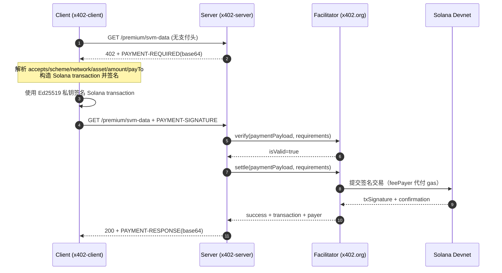

# x402 SVM 详细过程解析（中文）

- 运行时间：2026-03-14T03:20:14.453Z
- 资源地址：http://localhost:4020/premium/svm-data
- Facilitator：https://www.x402.org/facilitator
- 网络：Solana Devnet（`solana:EtWTRABZaYq6iMfeYKouRu166VU2xqa1`）
- 端到端耗时：2180 ms（首跳 15 ms + 二跳 2165 ms）

---

## 0) 执行概览

## 时序图（x402 SVM 双跳支付）



## 关键步骤说明（逐步）

1. **发现资源受保护**
   Client 首跳不带支付头，若资源需要付费，Server 返回 402，并通过 `PAYMENT-REQUIRED` header 明确支付条件。

2. **解析支付条件并做本地校验**
   Client 必须核对 `network/asset/payTo/amount/maxTimeoutSeconds` 是否符合预期，防止错链、错币或目标地址被替换。

3. **构造 Solana Transaction**
   Client 从 requirements 选定一条 `accepted`，按 x402 SVM exact 规则构造 Solana SPL Token transfer transaction。与 EVM 不同，SVM 的 payload 是一个完整的序列化 Solana transaction（base64），而非 EIP-712 typed data。

4. **本地签名**
   Client 用 Ed25519 私钥对 Solana transaction 进行签名。签名直接嵌入 transaction 的 signatures 数组中。

5. **二跳重试**
   Client 携带 `PAYMENT-SIGNATURE` header 重试同一资源请求，进入服务端验签结算路径。

6. **服务端验签（verify）**
   Server 调 facilitator `verify` 检查签名的 Solana transaction 有效性（签名正确、金额匹配、收款地址正确）。

7. **服务端结算（settle）**
   验签通过后，Server 调 facilitator `settle`，facilitator 将已签名的 transaction 提交到 Solana Devnet。**注意**：gas 费由 facilitator 的 feePayer 账户代付。

8. **返回业务数据 + 结算回执**
   成功后 Server 返回 200，并在 `PAYMENT-RESPONSE` header 带回 `success/transaction/network/payer`。

9. **链上核验闭环**
   Client/审计脚本可按 `transaction`（Solana txSignature）查询确认状态，与 HTTP 回执交叉验证。

---

本次流程遵循 x402 标准双跳模式：
1. **首跳（未携带支付）**：客户端请求受保护资源，服务端返回 `402 Payment Required` 与 `PAYMENT-REQUIRED`。
2. **二跳（携带支付签名）**：客户端根据首跳参数构造并签名支付对象，附带 `PAYMENT-SIGNATURE` 重试请求。
3. **结算与回包**：服务端校验并结算后返回 `200`，同时在 `PAYMENT-RESPONSE` 中返回结算结果。

本次结果：
- 首跳状态：`402`
- 二跳状态：`200`
- 结算交易：`5JoCh9NYRYNEUeFRZ3dLrsGVci2prf63vvg8UpUc5KD6jpWj4DkCwUwPwZn9By11kvTWh9XFhbGJEsiqCTprx8P1`

---

## 1) Request 阶段（请求与挑战）

### 1.1 首跳请求（作用）
首跳的核心作用是获取"支付挑战参数"（即服务端声明你要按什么条件付费）。

- Method：`GET`
- URL：`http://localhost:4020/premium/svm-data`
- 响应状态：`402`（预期应为 402）
- 耗时：15 ms

### 1.2 PAYMENT-REQUIRED 关键字段解释（按层级）

- 根对象
  - `x402Version`: `2`
  - `error`: `Payment required`
  - `resource`: 资源元信息对象
  - `accepts`: 可接受支付条件数组

- `resource` 对象
  - `resource.url`: `http://localhost:4020/premium/svm-data`
  - `resource.description`: `Premium x402-protected JSON (SVM)`
  - `resource.mimeType`: `application/json`

- `accepts[0]` 对象（本次选中条款）
  - `accepts[0].scheme`: `exact` — 精确金额支付模式
  - `accepts[0].network`: `solana:EtWTRABZaYq6iMfeYKouRu166VU2xqa1` — Solana Devnet（CAIP-2 格式，`EtWTRABZaYq6iMfeYKouRu166VU2xqa1` 是 Devnet 的 genesis hash 前缀）
  - `accepts[0].asset`: `4zMMC9srt5Ri5X14GAgXhaHii3GnPAEERYPJgZJDncDU` — USDC SPL Token Mint（Devnet）
  - `accepts[0].amount`: `1` — 最小单位（1 = 0.000001 USDC，因 USDC decimals=6）
  - `accepts[0].payTo`: `E55qLKqvQYabUwW6dhkC1QXTMfaYf2sX7p7UvETYXDZ1` — 收款方 Solana 地址
  - `accepts[0].maxTimeoutSeconds`: `300` — 签名最大有效期（5 分钟）
  - `accepts[0].extra`: 附加信息对象

- `accepts[0].extra` 对象
  - `accepts[0].extra.feePayer`: `CKPKJWNdJEqa81x7CkZ14BVPiY6y16Sxs7owznqtWYp5` — Facilitator 提供的 gas 代付账户（Solana 上交易费由此账户支付，买方无需持有 SOL）

PAYMENT-REQUIRED 原文（header base64）：
```
eyJ4NDAyVmVyc2lvbiI6MiwiZXJyb3IiOiJQYXltZW50IHJlcXVpcmVkIiwicmVzb3VyY2UiOnsidXJsIjoiaHR0cDovL2xvY2FsaG9zdDo0MDIwL3ByZW1pdW0vc3ZtLWRhdGEiLCJkZXNjcmlwdGlvbiI6IlByZW1pdW0geDQwMi1wcm90ZWN0ZWQgSlNPTiAoU1ZNKSIsIm1pbWVUeXBlIjoiYXBwbGljYXRpb24vanNvbiJ9LCJhY2NlcHRzIjpbeyJzY2hlbWUiOiJleGFjdCIsIm5ldHdvcmsiOiJzb2xhbmE6RXRXVFJBQlphWXE2aU1mZVlLb3VSdTE2NlZVMnhxYTEiLCJhbW91bnQiOiIxIiwiYXNzZXQiOiI0ek1NQzlzcnQ1Umk1WDE0R0FnWGhhSGlpM0duUEFFRVJZUEpnWkpEbmNEVSIsInBheVRvIjoiRTU1cUxLcXZRWWFiVXdXNmRoa0MxUVhUTWZhWWYyc1g3cDdVdkVUWVhEWjEiLCJtYXhUaW1lb3V0U2Vjb25kcyI6MzAwLCJleHRyYSI6eyJmZWVQYXllciI6IkNLUEtKV05kSkVxYTgxeDdDa1oxNEJWUGlZNnkxNlN4czdvd3pucXRXWXA1In19XX0=
```

PAYMENT-REQUIRED 解码：

```json
{
  "x402Version": 2,
  "error": "Payment required",
  "resource": {
    "url": "http://localhost:4020/premium/svm-data",
    "description": "Premium x402-protected JSON (SVM)",
    "mimeType": "application/json"
  },
  "accepts": [
    {
      "scheme": "exact",
      "network": "solana:EtWTRABZaYq6iMfeYKouRu166VU2xqa1",
      "amount": "1",
      "asset": "4zMMC9srt5Ri5X14GAgXhaHii3GnPAEERYPJgZJDncDU",
      "payTo": "E55qLKqvQYabUwW6dhkC1QXTMfaYf2sX7p7UvETYXDZ1",
      "maxTimeoutSeconds": 300,
      "extra": {
        "feePayer": "CKPKJWNdJEqa81x7CkZ14BVPiY6y16Sxs7owznqtWYp5"
      }
    }
  ]
}
```

---

## 2) Signature 阶段（签名构造与参数）

### 2.1 二跳请求（作用）
二跳请求的作用是证明"付款方已同意按首跳条件支付"。与 EVM 的 EIP-712 typed data 签名不同，SVM 的签名对象是一个 **完整的序列化 Solana transaction**。

- Method：`GET`
- URL：`http://localhost:4020/premium/svm-data`
- 耗时：2165 ms

PAYMENT-SIGNATURE 原文（header base64）：
```
eyJ4NDAyVmVyc2lvbiI6MiwicGF5bG9hZCI6eyJ0cmFuc2FjdGlvbiI6IkFnQUFBQUFBQUFBQUFBQUFBQUFBQUFBQUFBQUFBQUFBQUFBQUFBQUFBQUFBQUFBQUFBQUFBQUFBQUFBQUFBQUFBQUFBQUFBQUFBQUFBQUFBQUFBQUFBQ2VudlZnZlhBQjZJb3F4R3RBM3AxU05ZKzhMek9VV0VjZ0FhaWQ5ZXZKTlNwY1Z0WndCcXFvYWlxK3QyelI5MFNFd0hubnFUR3JHdEsxYW1LYWNUa05nQUlCQkFlb0pqNDIzMVFsVWRLMmIwZkozVlV4aW9nUlhkME5RaEJ2Sk82MjJaVUtmc0l6dCtWYmVkMnR0Z0ZLTGFqOXFQQUhsa0hWZGh2MTBmVElUVzhxOE4yUWF0Tnhva1ZjejVJcE1kNlVVREZVRlZGWGorZU10OUw3MUtYSFRlbHlwc2s3UkN5emtTRlg4VHFUUFFFMEtDMERLMS8relFHaTIvRzNlUVlJM3dBdXB3TUdSbS9sSVJjeS8reXR1bkxEbStlOGpPVzd4ZmNTYXl4RG16cEFBQUFBQlVwVFdwa3BJUVpOSk9oeFlObzRmSHcxdGQyOGtydUI1QitvUUVFRlJJMEczZmJoMTJXaGs5bkw0VWJPNjNtc0hMU0Y3VjliTjVFNmpQV0ZmdjhBcWR4OW50NmhzRkhtRXYzRFRwV1FDSjcxVk9RTENZQlhmeEFwRkpKTlpNMlVCQVFBQlFJZ1RnQUFCQUFKQXdFQUFBQUFBQUFBQmdRQ0F3SUJDZ3dCQUFBQUFBQUFBQVlGQUNCaE9XWm1PV1U1WTJRMlpHRmlPREU0WldKbFpHSTBNRE0wWTJRek9UUTBZZ0E9In0sInJlc291cmNlIjp7InVybCI6Imh0dHA6Ly9sb2NhbGhvc3Q6NDAyMC9wcmVtaXVtL3N2bS1kYXRhIiwiZGVzY3JpcHRpb24iOiJQcmVtaXVtIHg0MDItcHJvdGVjdGVkIEpTT04gKFNWTSkiLCJtaW1lVHlwZSI6ImFwcGxpY2F0aW9uL2pzb24ifSwiYWNjZXB0ZWQiOnsic2NoZW1lIjoiZXhhY3QiLCJuZXR3b3JrIjoic29sYW5hOkV0V1RSQUJaYVlxNmlNZmVZS291UnUxNjZWVTJ4cWExIiwiYW1vdW50IjoiMSIsImFzc2V0IjoiNHpNTUM5c3J0NVJpNVgxNEdBZ1hoYUhpaTNHblBBRUVSWVBKZ1pKRG5jRFUiLCJwYXlUbyI6IkU1NXFMS3F2UVlhYlV3VzZkaGtDMVFYVE1mYVlmMnNYN3A3VXZFVFlYRFoxIiwibWF4VGltZW91dFNlY29uZHMiOjMwMCwiZXh0cmEiOnsiZmVlUGF5ZXIiOiJDS1BLSldOZEpFcWE4MXg3Q2taMTRCVlBpWTZ5MTZTeHM3b3d6bnF0V1lwNSJ9fX0=
```

### 2.2 签名对象解释（按层级）

- 根对象
  - `x402Version`: `2`
  - `payload`: 签名载荷对象
  - `resource`: 资源对象（与首跳 challenge 对齐）
  - `accepted`: 本次接受的支付条款对象

- `payload` 对象
  - `payload.transaction`: base64 编码的完整 Solana transaction（包含签名 + 指令 + 账户）

- `accepted` 对象（与首跳 `accepts[0]` 一致）
  - `accepted.scheme`: `exact`
  - `accepted.network`: `solana:EtWTRABZaYq6iMfeYKouRu166VU2xqa1`
  - `accepted.asset`: `4zMMC9srt5Ri5X14GAgXhaHii3GnPAEERYPJgZJDncDU`（USDC Devnet Mint）
  - `accepted.amount`: `1`（0.000001 USDC）
  - `accepted.payTo`: `E55qLKqvQYabUwW6dhkC1QXTMfaYf2sX7p7UvETYXDZ1`
  - `accepted.maxTimeoutSeconds`: `300`
  - `accepted.extra.feePayer`: `CKPKJWNdJEqa81x7CkZ14BVPiY6y16Sxs7owznqtWYp5`

支付方地址（Payer）：`E55qLKqvQYabUwW6dhkC1QXTMfaYf2sX7p7UvETYXDZ1`

签名对象（完整解码）：

```json
{
  "x402Version": 2,
  "payload": {
    "transaction": "AgAAAAAAAAAAAAAAAAAAAAAAAAAAAAAAAAAAAAAAAAAAAAAAAAAAAAAAAAAAAAAAAAAAAAAAAAAAAAAAAAAAAACenvVgfXAB6IoqxGtA3p1SNY+8LzOUWEcgAaid9evJNSpcVtZwBqqoaiq+t2zR90SEwHnnqTGrGtK1amKacTkNgAIBBAeoJj4231QlUdK2b0fJ3VUxiogRXd0NQhBvJO622ZUKfsIzt+Vbed2ttgFKLaj9qPAHlkHVdhv10fTITW8q8N2QatNxokVcz5IpMd6UUDFUFVFXj+eMt9L71KXHTelypsk7RCyzkSFX8TqTPQE0KC0DK1/+zQGi2/G3eQYI3wAupwMGRm/lIRcy/+ytunLDm+e8jOW7xfcSayxDmzpAAAAABUpTWpkpIQZNJOhxYNo4fHw1td28kruB5B+oQEEFRI0G3fbh12Whk9nL4UbO63msHLSF7V9bN5E6jPWFfv8Aqdx9nt6hsFHmEv3DTpWQCJ71VOQLCYBXfxApFJJNZM2UBAQABQIgTgAABAAJAwEAAAAAAAAABgQCAwIBCgwBAAAAAAAAAAYFACBhOWZmOWU5Y2Q2ZGFiODE4ZWJlZGI0MDM0Y2QzOTQ0YgA="
  },
  "resource": {
    "url": "http://localhost:4020/premium/svm-data",
    "description": "Premium x402-protected JSON (SVM)",
    "mimeType": "application/json"
  },
  "accepted": {
    "scheme": "exact",
    "network": "solana:EtWTRABZaYq6iMfeYKouRu166VU2xqa1",
    "amount": "1",
    "asset": "4zMMC9srt5Ri5X14GAgXhaHii3GnPAEERYPJgZJDncDU",
    "payTo": "E55qLKqvQYabUwW6dhkC1QXTMfaYf2sX7p7UvETYXDZ1",
    "maxTimeoutSeconds": 300,
    "extra": {
      "feePayer": "CKPKJWNdJEqa81x7CkZ14BVPiY6y16Sxs7owznqtWYp5"
    }
  }
}
```

### 2.3 Solana Transaction 解析

> 与 EVM 的 EIP-712 typed data 不同，SVM 的 payload 是一个序列化的 Solana transaction。

**Transaction 结构说明**：

- **签名数量**：2（payer 签名 + feePayer 签名占位）
  - 签名 #1：全零（feePayer 占位，由 facilitator 在 settle 阶段补签）
  - 签名 #2：买方 Ed25519 签名（对 transaction message 签名）

- **账户列表**（transaction message 中的 accountKeys）：
  - `E55qLKqvQYabUwW6dhkC1QXTMfaYf2sX7p7UvETYXDZ1` — 买方（payer/source）
  - 买方 USDC ATA（Associated Token Account）
  - 收款方 USDC ATA
  - `CKPKJWNdJEqa81x7CkZ14BVPiY6y16Sxs7owznqtWYp5` — feePayer（facilitator 代付 gas）
  - SPL Token Program（`TokenkegQEqhL2PnEfl6YQ9d3pMt2Wqd1G8ptH5kP6v5FQxo`）
  - System Program
  - `4zMMC9srt5Ri5X14GAgXhaHii3GnPAEERYPJgZJDncDU` — USDC Mint

- **指令**：
  - SPL Token `Transfer` / `TransferChecked`：从买方 USDC ATA 转 `amount=1`（0.000001 USDC）到收款方 USDC ATA
  - Memo 指令：附带唯一 nonce 标识（防重放）

- **Recent Blockhash**：绑定当前 Solana slot，约 60-90 秒有效期（~150 slots）

**EVM vs SVM 签名方式对比**：

| 维度 | EVM (exact) | SVM (exact) |
|---|---|---|
| 签名格式 | EIP-712 typed data（`TransferWithAuthorization`） | Solana transaction（Ed25519） |
| 签名内容 | 结构化消息（from/to/value/nonce/validAfter/validBefore） | 完整 transaction message（含指令+账户+blockhash） |
| 防重放 | `nonce`（bytes32 随机值）+ `validAfter/validBefore` 时间窗 | `recentBlockhash`（~90s 有效）+ Memo nonce |
| Gas 支付 | 买方自付（ETH） | Facilitator feePayer 代付（SOL） |
| 签名算法 | ECDSA secp256k1 | Ed25519 |
| 资产转移 | EIP-3009 `TransferWithAuthorization` | SPL Token `Transfer` |

---

## 3) Settlement 阶段（服务端验签与结算）

### 3.1 PAYMENT-RESPONSE 作用
`PAYMENT-RESPONSE` 是结算回执，说明服务端/Facilitator 已完成支付处理并在 Solana Devnet 上提交了交易。

- 二跳响应状态：`200`
- 响应体：`{"data":{"message":"x402 SVM payment succeeded","timestamp":"2026-03-14T03:20:12.837Z"}}`

PAYMENT-RESPONSE 原文（header base64）：
```
eyJzdWNjZXNzIjp0cnVlLCJ0cmFuc2FjdGlvbiI6IjVKb0NoOU5ZUllORVVlRlJaM2RMcnNHVmNpMnByZjYzdnZnOFVwVWM1S0Q2anBXajREa0N3VXdQd1puOUJ5MTFrdlRXaDlYRmhiR0pFc2lxQ1Rwcng4UDEiLCJuZXR3b3JrIjoic29sYW5hOkV0V1RSQUJaYVlxNmlNZmVZS291UnUxNjZWVTJ4cWExIiwicGF5ZXIiOiJFNTVxTEtxdlFZYWJVd1c2ZGhrQzFRWFRNZmFZZjJzWDdwN1V2RVRZWERaMSJ9
```

PAYMENT-RESPONSE 解码：

```json
{
  "success": true,
  "transaction": "5JoCh9NYRYNEUeFRZ3dLrsGVci2prf63vvg8UpUc5KD6jpWj4DkCwUwPwZn9By11kvTWh9XFhbGJEsiqCTprx8P1",
  "network": "solana:EtWTRABZaYq6iMfeYKouRu166VU2xqa1",
  "payer": "E55qLKqvQYabUwW6dhkC1QXTMfaYf2sX7p7UvETYXDZ1"
}
```

关键参数解释：
- `success`: `true` — 结算成功
- `transaction`: `5JoCh9NYRYNEUeFRZ3dLrsGVci2prf63vvg8UpUc5KD6jpWj4DkCwUwPwZn9By11kvTWh9XFhbGJEsiqCTprx8P1` — Solana 交易签名（base58 编码，等价于 EVM 的 txHash）
- `network`: `solana:EtWTRABZaYq6iMfeYKouRu166VU2xqa1` — 结算网络
- `payer`: `E55qLKqvQYabUwW6dhkC1QXTMfaYf2sX7p7UvETYXDZ1` — facilitator 识别到的支付方地址

---

## 4) On-chain 阶段（链上凭证）

链上核验用于把 HTTP 层回执和真实链上状态对齐。

- txSignature：`5JoCh9NYRYNEUeFRZ3dLrsGVci2prf63vvg8UpUc5KD6jpWj4DkCwUwPwZn9By11kvTWh9XFhbGJEsiqCTprx8P1`
- 网络：Solana Devnet

### 4.1 Solana 交易特点（vs EVM）

| 维度 | EVM | Solana |
|---|---|---|
| 交易标识 | txHash（32 bytes hex） | txSignature（base58 编码） |
| 确认模型 | 区块确认数 | finalized/confirmed/processed |
| 结算时间 | ~2s（Base Sepolia） | ~0.4s（slot time） |
| Gas 模型 | gas × gasPrice（ETH） | compute units × priority fee（SOL） |
| 交易有效期 | 无硬限制（靠 nonce） | ~90s（recentBlockhash 过期） |

---

## 5) 风险与检查建议

- 检查 `accepted` 与首跳 `accepts` 是否一致（防参数替换）
- 检查 `network` 是否为 `solana:EtWTRABZaYq6iMfeYKouRu166VU2xqa1`（Devnet），防止被引导到 mainnet
- 检查 `asset` 是否为预期的 USDC Devnet Mint 地址（`4zMMC9srt5Ri5X14GAgXhaHii3GnPAEERYPJgZJDncDU`）
- 检查 `payTo` 是否为预期收款地址
- `feePayer` 由 facilitator 控制（`CKPKJWNdJEqa81x7CkZ14BVPiY6y16Sxs7owznqtWYp5`），买方无需持有 SOL
- 保证私钥仅在 client 侧存在，不进入 server 日志
- Solana transaction 的 `recentBlockhash` 约 90s 过期，天然缩小重放窗口
- Memo 指令中的 nonce 提供额外防重放保护

## 6) 可补充信息（建议增强）

### 6.1 参数可读化
- `network`: `solana:EtWTRABZaYq6iMfeYKouRu166VU2xqa1`（Solana Devnet，genesis hash 前缀）
- `asset`: `4zMMC9srt5Ri5X14GAgXhaHii3GnPAEERYPJgZJDncDU`（USDC SPL Token，decimals=6）
- `amount`: `1`（即 `0.000001 USDC`）
- `feePayer`: `CKPKJWNdJEqa81x7CkZ14BVPiY6y16Sxs7owznqtWYp5`（facilitator 代付 gas）
- `maxTimeoutSeconds`: `300`（5 分钟签名有效窗口）

### 6.2 外部核验链接
- Tx: <https://explorer.solana.com/tx/5JoCh9NYRYNEUeFRZ3dLrsGVci2prf63vvg8UpUc5KD6jpWj4DkCwUwPwZn9By11kvTWh9XFhbGJEsiqCTprx8P1?cluster=devnet>
- Payer: <https://explorer.solana.com/address/E55qLKqvQYabUwW6dhkC1QXTMfaYf2sX7p7UvETYXDZ1?cluster=devnet>
- USDC Mint: <https://explorer.solana.com/address/4zMMC9srt5Ri5X14GAgXhaHii3GnPAEERYPJgZJDncDU?cluster=devnet>
- feePayer: <https://explorer.solana.com/address/CKPKJWNdJEqa81x7CkZ14BVPiY6y16Sxs7owznqtWYp5?cluster=devnet>

### 6.3 执行环境
- 运行模式：本地 tsx（server + client 分进程）
- 服务暴露：`127.0.0.1:4020`（仅本机）
- Facilitator：`https://www.x402.org/facilitator`
- SDK 版本：`@x402/svm@2.6.0`，`@solana/kit@5.5.1`

---

> 该报告基于 `svm-run-and-report.ts` 生成的 JSON 运行产物手动增强。
