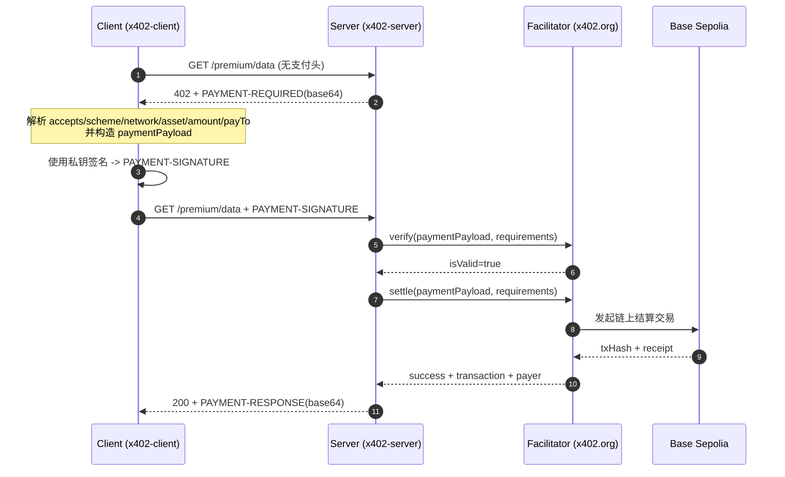

# x402 详细审计报告（中文）

- 运行时间：2026-03-10T15:09:29.065Z
- 资源地址：http://localhost:4020/premium/data
- Facilitator：https://x402.org/facilitator
- 端到端耗时：1123 ms（首跳 3 ms + 二跳 1120 ms）

---

## 0) 执行概览


## 时序图（x402 双跳支付）



## 关键步骤说明（逐步）

1. **发现资源受保护**  
   Client 首跳不带支付，若资源需要付费，Server 返回 402，并通过 `PAYMENT-REQUIRED` 明确支付条件。

2. **解析支付条件并做本地校验**  
   Client 必须核对 `network/asset/payTo/amount/maxTimeoutSeconds` 是否符合预期，防止错链、错币或目标地址被替换。

3. **生成签名载荷（Payment Payload）**  
   Client 从 requirements 选定一条 `accepted`，按 x402 exact 规则构造 payload。

4. **本地签名**  
   Client 用本地私钥对 payload 进行签名，输出 `payload.signature`，并封装为 `PAYMENT-SIGNATURE` header。

5. **二跳重试**  
   Client 携带 `PAYMENT-SIGNATURE` 重试同一资源请求，进入服务端验签结算路径。

6. **服务端验签（verify）**  
   Server 调 facilitator `verify` 检查签名有效性与参数一致性（与 requirements 匹配）。

7. **服务端结算（settle）**  
   验签通过后，Server 调 facilitator `settle`，facilitator 在目标链上提交结算交易。

8. **返回业务数据 + 结算回执**  
   成功后 Server 返回 200，并在 `PAYMENT-RESPONSE` 带回 `success/transaction/network/payer`。

9. **链上核验闭环**  
   Client/审计脚本可按 `txHash` 查询 receipt，与 HTTP 回执交叉验证，形成可审计证据链。

---

本次流程遵循 x402 标准双跳模式：
1. **首跳（未携带支付）**：客户端请求受保护资源，服务端返回 `402 Payment Required` 与 `PAYMENT-REQUIRED`。
2. **二跳（携带支付签名）**：客户端根据首跳参数构造并签名支付对象，附带 `PAYMENT-SIGNATURE` 重试请求。
3. **结算与回包**：服务端校验并结算后返回 `200`，同时在 `PAYMENT-RESPONSE` 中返回结算结果。

本次结果：
- 首跳状态：`402`
- 二跳状态：`200`
- 结算交易：`0xa753c83676303bf5675e668b7c700c20d834e6882e0c7e2b45bd01d08f3642a6`

---

## 1) Request 阶段（请求与挑战）

### 1.1 首跳请求（作用）
首跳的核心作用是获取“支付挑战参数”（即服务端声明你要按什么条件付费）。

- Method：`GET`
- URL：`http://localhost:4020/premium/data`
- 响应状态：`402`（预期应为 402）

### 1.2 PAYMENT-REQUIRED 关键字段解释

- `scheme`: 支付方案。当前为 `exact`（精确金额支付）。
- `network`: 链标识（CAIP 风格），如 `eip155:84532` 表示 Base Sepolia。
- `asset`: 代币合约地址（本次为 Base Sepolia USDC）。
- `amount`: 支付最小单位（USDC 6 位精度，`1000`=0.001 USDC）。
- `payTo`: 收款地址。
- `maxTimeoutSeconds`: 签名有效窗口，防止支付对象被长期重放。
- `resource`: 被保护资源描述（URL、description、mimeType）。

PAYMENT-REQUIRED 原文（header）：
`eyJ4NDAyVmVyc2lvbiI6MiwiZXJyb3IiOiJQYXltZW50IHJlcXVpcmVkIiwicmVzb3VyY2UiOnsidXJsIjoiaHR0cDovL2xvY2FsaG9zdDo0MDIwL3ByZW1pdW0vZGF0YSIsImRlc2NyaXB0aW9uIjoiUHJlbWl1bSB4NDAyLXByb3RlY3RlZCBKU09OIiwibWltZVR5cGUiOiJhcHBsaWNhdGlvbi9qc29uIn0sImFjY2VwdHMiOlt7InNjaGVtZSI6ImV4YWN0IiwibmV0d29yayI6ImVpcDE1NTo4NDUzMiIsImFtb3VudCI6IjEwMDAiLCJhc3NldCI6IjB4MDM2Q2JENTM4NDJjNTQyNjYzNGU3OTI5NTQxZUMyMzE4ZjNkQ0Y3ZSIsInBheVRvIjoiMHg5MkY2RTlkZUJiRWI3NzhhMjQ1OTE2Q2Y1MkREN0Y1NDQyOUZmZjI0IiwibWF4VGltZW91dFNlY29uZHMiOjMwMCwiZXh0cmEiOnsibmFtZSI6IlVTREMiLCJ2ZXJzaW9uIjoiMiJ9fV19`

PAYMENT-REQUIRED 解码：

```json
{
  "x402Version": 2,
  "error": "Payment required",
  "resource": {
    "url": "http://localhost:4020/premium/data",
    "description": "Premium x402-protected JSON",
    "mimeType": "application/json"
  },
  "accepts": [
    {
      "scheme": "exact",
      "network": "eip155:84532",
      "amount": "1000",
      "asset": "0x036CbD53842c5426634e7929541eC2318f3dCF7e",
      "payTo": "0x92F6E9deBbEb778a245916Cf52DD7F54429Fff24",
      "maxTimeoutSeconds": 300,
      "extra": {
        "name": "USDC",
        "version": "2"
      }
    }
  ]
}
```

---

## 2) Signature 阶段（签名构造与参数）

### 2.1 二跳请求（作用）
二跳请求的作用是证明“付款方已同意按首跳条件支付”。

- Method：`GET`
- URL：`http://localhost:4020/premium/data`
- PAYMENT-SIGNATURE（原文）：
`eyJ4NDAyVmVyc2lvbiI6MiwicGF5bG9hZCI6eyJhdXRob3JpemF0aW9uIjp7ImZyb20iOiIweDkyRjZFOWRlQmJFYjc3OGEyNDU5MTZDZjUyREQ3RjU0NDI5RmZmMjQiLCJ0byI6IjB4OTJGNkU5ZGVCYkViNzc4YTI0NTkxNkNmNTJERDdGNTQ0MjlGZmYyNCIsInZhbHVlIjoiMTAwMCIsInZhbGlkQWZ0ZXIiOiIxNzczMTU0NzY3IiwidmFsaWRCZWZvcmUiOiIxNzczMTU1NjY3Iiwibm9uY2UiOiIweDQ2YWNhN2FmYzAzYmU5ODBjMjI4MWE3NDBiOWYxY2ZmYTgxYWE3NGZmNmI2ZTUxYjIzNDA4MDMwMjI1OGM0ZTcifSwic2lnbmF0dXJlIjoiMHg1YTlkNGFkOWI2ZTI4MDMxY2Y2ZWNkNTJjOGFjNTdjYWYzNzJlOWU4ZjY2YTkwZjBmMjI5NDdlZGEyZTA5MDAyMzY2YjQyYWEyYTczNWEwNzA0NTYyYWNmOWE3ZDA2M2M0OGY2OWY3MzdlNmEyYjFlNWUyNzY0ZTRiNTc4ODY1ZjFjIn0sInJlc291cmNlIjp7InVybCI6Imh0dHA6Ly9sb2NhbGhvc3Q6NDAyMC9wcmVtaXVtL2RhdGEiLCJkZXNjcmlwdGlvbiI6IlByZW1pdW0geDQwMi1wcm90ZWN0ZWQgSlNPTiIsIm1pbWVUeXBlIjoiYXBwbGljYXRpb24vanNvbiJ9LCJhY2NlcHRlZCI6eyJzY2hlbWUiOiJleGFjdCIsIm5ldHdvcmsiOiJlaXAxNTU6ODQ1MzIiLCJhbW91bnQiOiIxMDAwIiwiYXNzZXQiOiIweDAzNkNiRDUzODQyYzU0MjY2MzRlNzkyOTU0MWVDMjMxOGYzZENGN2UiLCJwYXlUbyI6IjB4OTJGNkU5ZGVCYkViNzc4YTI0NTkxNkNmNTJERDdGNTQ0MjlGZmYyNCIsIm1heFRpbWVvdXRTZWNvbmRzIjozMDAsImV4dHJhIjp7Im5hbWUiOiJVU0RDIiwidmVyc2lvbiI6IjIifX19`

### 2.2 签名对象解释

签名对象一般包含：
- `x402Version`：协议版本（本次 v2）
- `accepted`：实际接受的支付条款（应与 `PAYMENT-REQUIRED.accepts` 匹配）
- `payload.signature`：私钥对支付对象的签名结果
- 与 `network/asset/amount/payTo` 绑定的关键字段（防篡改）

支付方地址（Payer）：`0x92F6E9deBbEb778a245916Cf52DD7F54429Fff24`

签名对象：

```json
{
  "x402Version": 2,
  "payload": {
    "authorization": {
      "from": "0x92F6E9deBbEb778a245916Cf52DD7F54429Fff24",
      "to": "0x92F6E9deBbEb778a245916Cf52DD7F54429Fff24",
      "value": "1000",
      "validAfter": "1773154767",
      "validBefore": "1773155667",
      "nonce": "0x46aca7afc03be980c2281a740b9f1cffa81aa74ff6b6e51b234080302258c4e7"
    },
    "signature": "0x5a9d4ad9b6e28031cf6ecd52c8ac57caf372e9e8f66a90f0f22947eda2e09002366b42aa2a735a0704562acf9a7d063c48f69f737e6a2b1e5e2764e4b578865f1c"
  },
  "resource": {
    "url": "http://localhost:4020/premium/data",
    "description": "Premium x402-protected JSON",
    "mimeType": "application/json"
  },
  "accepted": {
    "scheme": "exact",
    "network": "eip155:84532",
    "amount": "1000",
    "asset": "0x036CbD53842c5426634e7929541eC2318f3dCF7e",
    "payTo": "0x92F6E9deBbEb778a245916Cf52DD7F54429Fff24",
    "maxTimeoutSeconds": 300,
    "extra": {
      "name": "USDC",
      "version": "2"
    }
  }
}
```

支付载荷（Payment Payload）：

```json
{
  "x402Version": 2,
  "payload": {
    "authorization": {
      "from": "0x92F6E9deBbEb778a245916Cf52DD7F54429Fff24",
      "to": "0x92F6E9deBbEb778a245916Cf52DD7F54429Fff24",
      "value": "1000",
      "validAfter": "1773154767",
      "validBefore": "1773155667",
      "nonce": "0x46aca7afc03be980c2281a740b9f1cffa81aa74ff6b6e51b234080302258c4e7"
    },
    "signature": "0x5a9d4ad9b6e28031cf6ecd52c8ac57caf372e9e8f66a90f0f22947eda2e09002366b42aa2a735a0704562acf9a7d063c48f69f737e6a2b1e5e2764e4b578865f1c"
  },
  "resource": {
    "url": "http://localhost:4020/premium/data",
    "description": "Premium x402-protected JSON",
    "mimeType": "application/json"
  },
  "accepted": {
    "scheme": "exact",
    "network": "eip155:84532",
    "amount": "1000",
    "asset": "0x036CbD53842c5426634e7929541eC2318f3dCF7e",
    "payTo": "0x92F6E9deBbEb778a245916Cf52DD7F54429Fff24",
    "maxTimeoutSeconds": 300,
    "extra": {
      "name": "USDC",
      "version": "2"
    }
  }
}
```

签名结果（Hex）：
`0x5a9d4ad9b6e28031cf6ecd52c8ac57caf372e9e8f66a90f0f22947eda2e09002366b42aa2a735a0704562acf9a7d063c48f69f737e6a2b1e5e2764e4b578865f1c`

---

## 3) Settlement 阶段（服务端验签与结算）

### 3.1 PAYMENT-RESPONSE 作用
`PAYMENT-RESPONSE` 是结算回执，说明服务端/Facilitator 已完成支付处理。

- PAYMENT-RESPONSE 原文：
`eyJzdWNjZXNzIjp0cnVlLCJ0cmFuc2FjdGlvbiI6IjB4YTc1M2M4MzY3NjMwM2JmNTY3NWU2NjhiN2M3MDBjMjBkODM0ZTY4ODJlMGM3ZTJiNDViZDAxZDA4ZjM2NDJhNiIsIm5ldHdvcmsiOiJlaXAxNTU6ODQ1MzIiLCJwYXllciI6IjB4OTJGNkU5ZGVCYkViNzc4YTI0NTkxNkNmNTJERDdGNTQ0MjlGZmYyNCJ9`

- PAYMENT-RESPONSE 解码：

```json
{
  "success": true,
  "transaction": "0xa753c83676303bf5675e668b7c700c20d834e6882e0c7e2b45bd01d08f3642a6",
  "network": "eip155:84532",
  "payer": "0x92F6E9deBbEb778a245916Cf52DD7F54429Fff24"
}
```

关键参数解释：
- `success`: 是否结算成功
- `transaction`: 结算交易哈希
- `network`: 结算所在网络
- `payer`: facilitator 识别到的支付方地址

---

## 4) On-chain 阶段（链上凭证）

链上核验用于把 HTTP 层回执和真实链上状态对齐。

- txHash：`0xa753c83676303bf5675e668b7c700c20d834e6882e0c7e2b45bd01d08f3642a6`
- receipt.status：`success`
- receipt.blockNumber：`38693541`
- receipt.from：`0xd407e409e34e0b9afb99ecceb609bdbcd5e7f1bf`
- receipt.to：`0x036cbd53842c5426634e7929541ec2318f3dcf7e`
- receipt.gasUsed：`78188`
- receipt.effectiveGasPrice：`6000000`
- receipt.logs 数量：`2`

### 4.1 余额核对（运行前后）
- Before：ETH 0.01，USDC 40（raw 40000000）
- After：ETH 0.01，USDC 40（raw 40000000）

说明：若支付金额较小且同地址收款，余额变化可能不明显（尤其在展示精度较低时）。建议结合 raw 值与交易日志核对。

---

## 5) 风险与检查建议

- 检查 `accepted` 与首跳 `accepts` 是否一致（防参数替换）。
- 检查 `network/asset` 是否为预期测试网资产（防错链）。
- 检查 `maxTimeoutSeconds` 是否合理（防重放窗口过大）。
- 保证私钥仅在 client 侧存在，不进入 server 日志。
- 在生产环境启用更细粒度审计字段（requestId、nonce、签名摘要等）。

---

> 该报告由 `scripts/render-audit-report-detailed.mjs` 从 JSON 运行产物自动生成。
