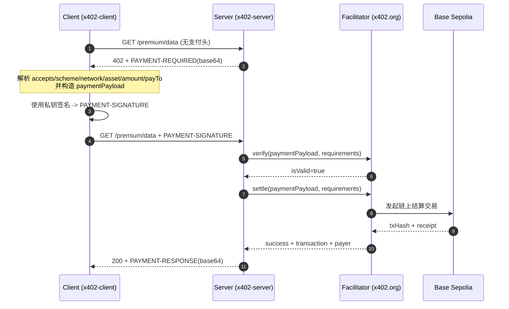

# x402 详细审计报告（中文）

- 运行时间：{{meta.timestamp}}
- 资源地址：{{meta.resourceUrl}}
- Facilitator：{{meta.facilitatorUrl}}
- 端到端耗时：{{meta.durationMs.total}} ms（首跳 {{meta.durationMs.request1}} ms + 二跳 {{meta.durationMs.request2}} ms）

---

## 0) 执行概览


## 时序图（x402 双跳支付）



## 关键步骤说明（逐步）

1. **发现资源受保护**  
   Client 首跳不带支付，若资源需要付费，Server 返回 402，并通过 `PAYMENT-REQUIRED` 明确支付条件。

2. **解析支付条件并做本地校验**  
   Client 必须核对 `network/asset/payTo/amount/maxTimeoutSeconds` 是否符合预期，防止错链、错币或目标地址被替换。

3. **生成签名载荷（Payment Payload）**  
   Client 从 requirements 选定一条 `accepted`，按 x402 exact 规则构造 payload。

4. **本地签名**  
   Client 用本地私钥对 payload 进行签名，输出 `payload.signature`，并封装为 `PAYMENT-SIGNATURE` header。

5. **二跳重试**  
   Client 携带 `PAYMENT-SIGNATURE` 重试同一资源请求，进入服务端验签结算路径。

6. **服务端验签（verify）**  
   Server 调 facilitator `verify` 检查签名有效性与参数一致性（与 requirements 匹配）。

7. **服务端结算（settle）**  
   验签通过后，Server 调 facilitator `settle`，facilitator 在目标链上提交结算交易。

8. **返回业务数据 + 结算回执**  
   成功后 Server 返回 200，并在 `PAYMENT-RESPONSE` 带回 `success/transaction/network/payer`。

9. **链上核验闭环**  
   Client/审计脚本可按 `txHash` 查询 receipt，与 HTTP 回执交叉验证，形成可审计证据链。

---

本次流程遵循 x402 标准双跳模式：
1. **首跳（未携带支付）**：客户端请求受保护资源，服务端返回 `402 Payment Required` 与 `PAYMENT-REQUIRED`。
2. **二跳（携带支付签名）**：客户端根据首跳参数构造并签名支付对象，附带 `PAYMENT-SIGNATURE` 重试请求。
3. **结算与回包**：服务端校验并结算后返回 `200`，同时在 `PAYMENT-RESPONSE` 中返回结算结果。

本次结果：
- 首跳状态：`{{http.firstResponse.status}}`
- 二跳状态：`{{http.secondResponse.status}}`
- 结算交易：`{{settlement.txHash}}`

---

## 1) Request 阶段（请求与挑战）

### 1.1 首跳请求（作用）
首跳的核心作用是获取“支付挑战参数”（即服务端声明你要按什么条件付费）。

- Method：`{{http.firstRequest.method}}`
- URL：`{{http.firstRequest.url}}`
- 响应状态：`{{http.firstResponse.status}}`（预期应为 402）

### 1.2 PAYMENT-REQUIRED 关键字段解释（按层级）

- 根对象
  - `x402Version`: 协议版本。
  - `error`: 错误说明（通常是 `Payment required`）。
  - `resource`: 资源元信息对象。
  - `accepts`: 可接受支付条件数组（可多条）。

- `resource` 对象
  - `resource.url`: 被保护资源 URL。
  - `resource.description`: 资源描述。
  - `resource.mimeType`: 返回内容类型。

- `accepts[]` 数组中的单条（核心支付条款）
  - `accepts[i].scheme`: 支付方案（当前常见 `exact`）。
  - `accepts[i].network`: 网络标识（CAIP 风格，如 `eip155:84532`）。
  - `accepts[i].asset`: 资产合约地址（例如 Base Sepolia USDC）。
  - `accepts[i].amount`: 支付最小单位金额（USDC 6 位精度时，`1000`=0.001 USDC）。
  - `accepts[i].payTo`: 收款地址。
  - `accepts[i].maxTimeoutSeconds`: 授权有效窗口（防重放）。
  - `accepts[i].extra`: 资产/域附加信息。

- `accepts[i].extra` 对象（EVM 常见）
  - `accepts[i].extra.name`: EIP-712 domain name（例如 `USDC`）。
  - `accepts[i].extra.version`: EIP-712 domain version（例如 `2`）。

PAYMENT-REQUIRED 原文（header）：
`{{http.firstResponse.headers.paymentRequired}}`

PAYMENT-REQUIRED 解码：

```json
{{http.firstResponse.paymentRequiredDecoded.json}}
```

---

## 2) Signature 阶段（签名构造与参数）

### 2.1 二跳请求（作用）
二跳请求的作用是证明“付款方已同意按首跳条件支付”。

- Method：`{{http.secondRequest.method}}`
- URL：`{{http.secondRequest.url}}`
- PAYMENT-SIGNATURE（原文）：
`{{http.secondRequest.headers.PAYMENT-SIGNATURE}}`

### 2.2 签名对象解释（按层级）

- 根对象
  - `x402Version`: 协议版本。
  - `payload`: 签名载荷对象。
  - `resource`: 资源对象（与首跳 challenge 对齐）。
  - `accepted`: 本次选择并接受的支付条款（应来自 `PAYMENT-REQUIRED.accepts[]`）。

- `payload` 对象
  - `payload.authorization`: 实际授权消息（被签名核心）。
  - `payload.signature`: 对授权消息的签名结果（hex）。

- `payload.authorization` 对象（EIP-3009 风格）
  - `payload.authorization.from`: 授权付款方。
  - `payload.authorization.to`: 授权收款方。
  - `payload.authorization.value`: 授权金额（最小单位）。
  - `payload.authorization.validAfter`: 生效起始时间。
  - `payload.authorization.validBefore`: 失效时间。
  - `payload.authorization.nonce`: 随机 nonce（防重放）。

- `accepted` 对象（验签与结算绑定）
  - `accepted.scheme/network/asset/amount/payTo/maxTimeoutSeconds/extra`：
    与首跳条款一致；facilitator 会据此验证签名与请求参数的一致性。

支付方地址（Payer）：`{{addresses.payer}}`

签名对象：

```json
{{signing.signatureObject.json}}
```

支付载荷（Payment Payload）：

```json
{{signing.paymentPayload.json}}
```

签名结果（Hex）：
`{{signing.signatureHex}}`

### 2.3 完整原始签名消息（EIP-712 Typed Data）

> 说明：`payload.signature` 对下面这份 typed data 进行签名（primaryType: `TransferWithAuthorization`）。

```json
{{signing.eip712TypedData.json}}
```

---

## 3) Settlement 阶段（服务端验签与结算）

### 3.1 PAYMENT-RESPONSE 作用
`PAYMENT-RESPONSE` 是结算回执，说明服务端/Facilitator 已完成支付处理。

- PAYMENT-RESPONSE 原文：
`{{http.secondResponse.headers.paymentResponse}}`

- PAYMENT-RESPONSE 解码：

```json
{{http.secondResponse.paymentResponseDecoded.json}}
```

关键参数解释：
- `success`: 是否结算成功
- `transaction`: 结算交易哈希
- `network`: 结算所在网络
- `payer`: facilitator 识别到的支付方地址

---

## 4) On-chain 阶段（链上凭证）

链上核验用于把 HTTP 层回执和真实链上状态对齐。

- txHash：`{{settlement.txHash}}`
- receipt.status：`{{settlement.txReceipt.status}}`
- receipt.blockNumber：`{{settlement.txReceipt.blockNumber}}`
- receipt.from：`{{settlement.txReceipt.from}}`
- receipt.to：`{{settlement.txReceipt.to}}`
- receipt.gasUsed：`{{settlement.txReceipt.gasUsed}}`
- receipt.effectiveGasPrice：`{{settlement.txReceipt.effectiveGasPrice}}`
- receipt.logs 数量：`{{settlement.logsCount}}`

### 4.1 余额核对（运行前后）
- Before：ETH {{balances.before.eth}}，USDC {{balances.before.usdc}}（raw {{balances.before.usdcRaw}}）
- After：ETH {{balances.after.eth}}，USDC {{balances.after.usdc}}（raw {{balances.after.usdcRaw}}）

说明：若支付金额较小且同地址收款，余额变化可能不明显（尤其在展示精度较低时）。建议结合 raw 值与交易日志核对。

---

## 5) 风险与检查建议

- 检查 `accepted` 与首跳 `accepts` 是否一致（防参数替换）。
- 检查 `network/asset` 是否为预期测试网资产（防错链）。
- 检查 `maxTimeoutSeconds` 是否合理（防重放窗口过大）。
- 保证私钥仅在 client 侧存在，不进入 server 日志。
- 在生产环境启用更细粒度审计字段（requestId、nonce、签名摘要等）。

---

> 该报告由 `scripts/render-audit-report-detailed.mjs` 从 JSON 运行产物自动生成。
